# Civil Engineering Project Copilot — High-Level Proposal

**Document date:** 23 August 2026  
**Pilot focus:** India-based building / structural-steel academic demonstration  
**Repository status:** Public-data collection, portable corpus preparation, and approved target architecture  
**Not built:** Running PostgreSQL, Qdrant, Neo4j, RAG, tools, agents, or Mem0 integration

> **How to read this proposal:** “Exists now” describes files verifiable in this repository. “Selected” describes an approved technology or design that is not necessarily running. “Future” describes later implementation. Synthetic project records are planned but have not yet been created.

## 1. Executive Summary

Civil engineering projects generate large amounts of fragmented, versioned information across drawings, specifications, RFIs, submittals, schedules, contracts, meeting minutes, inspections, BIM models, and field reports. Teams lose time finding the authoritative source, connecting related records, and understanding how one issue affects downstream work.

The proposed **Civil Engineering Project Copilot** is an evidence-first assistant that retrieves project information, connects related records, and explains its conclusions with citations. The approved target design combines conventional RAG, hybrid retrieval, controlled tools, and a project relationship map. Simple questions use direct retrieval; complex questions may later use a controlled Agentic RAG workflow.

The first implementation should create one **correlated synthetic India-based steel-building project or structural-steel work package** and connect it to the public reference material already collected. This provides enough controlled data to demonstrate direct RAG, relationships, tools, and later an agent without claiming that unrelated public samples form one real project. A future real-project pilot would then validate the same design using authorized records.

### Current repository truth

| Item | Status on 23 August 2026 |
|---|---|
| Four buildingSMART IFC models and one BCF sample | **Public — downloaded**; reusable technical samples, but not one Indian project |
| BIS catalogue/search and public preview pages | **Public — downloaded** from official pages |
| `data/public/bis/academic/INDEX.jsonl` | **Exists now**; a portable prepared corpus of 138 labelled chunks, not a running search index |
| Guwahati tender, Assam rules, and CPWD references | **Public — link only**; catalogued but not copied into the repository |
| Correlated steel-building RFIs, revisions, schedule, materials, and inspections | **Synthetic — planned**; not created yet |
| PostgreSQL, Qdrant, Neo4j, RAG application, tools, agents, and Mem0 | **Selected but not implemented** |

**Terminology note:** IS 800 is an Indian Standard and a structural-steel **code of practice**. It is not a “code of conduct,” which normally describes professional behavior. In this proposal, the umbrella label is **Indian codes and standards**.

## 2. Problem Statement

Project information is distributed across systems and file formats, often with inconsistent naming, duplicate records, and multiple revisions. Traditional keyword search can find a document but usually cannot answer questions that require:

- combining evidence from several sources;
- resolving exact identifiers such as `RFI-087` or `S-204 Rev 5`;
- determining which version was valid at a specific date;
- tracing dependencies between an RFI, a drawing, an activity, and a milestone;
- calculating schedule or downstream impact; or
- explaining an answer in a form that a project professional can verify.

The result is avoidable search time, slower issue resolution, weak organizational memory, and late discovery of project risk. The Copilot should reduce this burden without presenting model-generated advice as an authoritative engineering decision.

## 3. Target Users

| User | Primary need |
|---|---|
| Project manager | Understand status, blockers, dependencies, and emerging risks |
| Project engineer | Find requirements, RFIs, submittals, and drawing references quickly |
| Scheduler / planner | Trace issues to activities, milestones, float, and critical-path impact |
| Design manager / discipline lead | Compare revisions and follow cross-discipline dependencies |
| Superintendent / field engineer | Get current, field-relevant answers with source evidence |
| Owner / program manager | Obtain concise, auditable summaries across projects |

## 4. Product Vision and Principles

The Copilot should function as a **project investigation partner**, not merely a chat interface over files.

1. **Evidence before eloquence:** Every material claim should point to a source page, record, schedule activity, or graph path.
2. **Right method for the question:** Use exact search, semantic search, structured calculation, or graph traversal as appropriate.
3. **Fast path before agent path:** Do not invoke a multi-step agent when one retrieval pass can answer the question.
4. **Version and time awareness:** Preserve document revisions, effective dates, superseded status, and record history.
5. **Permission-aware by design:** Retrieval must enforce the source system's project and document access rules.
6. **Human accountability:** The system supports investigation and decision-making; it does not approve designs, direct field work, or make contractual determinations.

### Initial non-goals

- Autonomous engineering or safety decisions
- Automatic changes to schedules, RFIs, or source systems
- Full CAD/BIM geometric reasoning in the first release
- Agent implementation before the data-readiness and correlation gates are met
- Organization-wide rollout before a single-project pilot succeeds

## 5. Flagship Use Cases

These are target product use cases. During the Data Foundation phase they are used to identify required records and relationships—not to justify building an agent prematurely.

> **Figure status: MIXED TIMELINE.** Only the first column describes current repository files; the remaining columns describe planned or future capability.

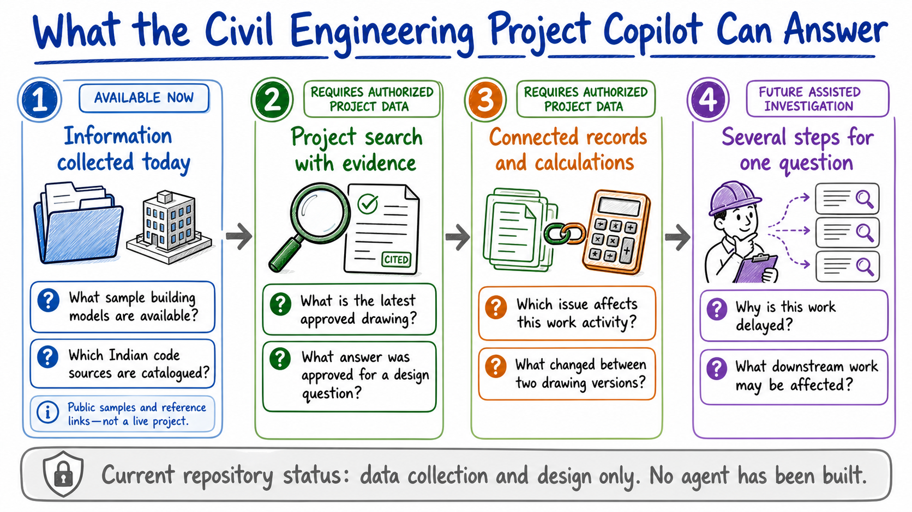

*Status: capability roadmap. “Available now” means file-based data demonstrations; the project-search and assisted-investigation columns are future work.*

| Question | Required behavior |
|---|---|
| “What does the specification require for concrete curing?” | Retrieve the correct specification section and answer with page/section citations |
| “Show the current status of RFI-087 and the latest response.” | Use exact-ID retrieval, revision/status metadata, and attachments |
| “Why is Level 4 HVAC delayed?” | Combine schedule data, RFIs, meeting minutes, and dependency evidence |
| “Which unresolved RFIs affect critical-path activities?” | Query RFI status, traverse RFI-to-activity links, and run schedule logic |
| “What changed between S-204 Rev 3 and Rev 5?” | Compare authoritative revisions and cite the changed sheets/regions |
| “What happens if RFI-087 remains unresolved for two more weeks?” | Traverse downstream dependencies and calculate schedule scenarios |
| “What are the top current project risks?” | Produce a ranked, evidence-backed summary and clearly label inferred risks |

### Product mockup: a direct evidence answer

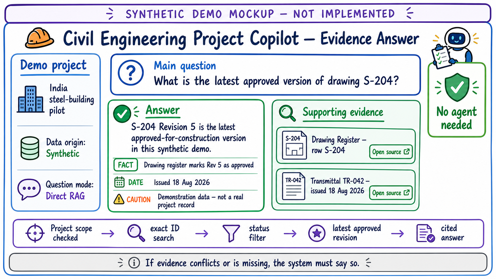

*Status: synthetic product mockup — not implemented. The drawing, transmittal, dates, and answer are deliberately fictional and will belong to the planned correlated demo dataset.*

## 6. Data Sources and Ingestion

The detailed discovery inventory is maintained in [Data Foundation](docs/DATA_FOUNDATION.md). Execution uses the [Data Collection Register](docs/DATA_COLLECTION_REGISTER.md), [Correlation Matrix](docs/CORRELATION_MATRIX.md), and [Pilot Data Handoff Checklist](docs/PILOT_DATA_HANDOFF.md). Applicable Indian regulatory and standards sources are maintained separately in the [Indian Standards Register](docs/INDIAN_STANDARDS_REGISTER.md). Actual reusable and link-only research sources are assessed in the [Public Data Catalogue](docs/PUBLIC_DATA_CATALOG.md).

### Data origin and availability

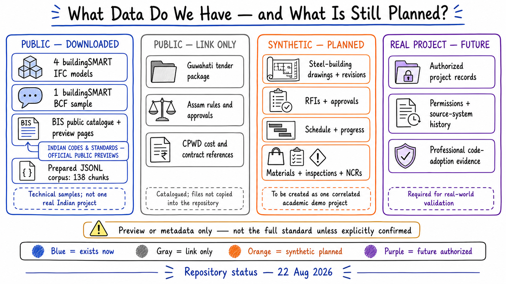

This is the authoritative visual summary of data origin. In particular:

- BIS material is labelled **Indian codes and standards — official public previews**;
- no public preview is silently represented as the complete standard;
- the synthetic steel-building project is planned, not downloaded; and
- authorized real-project data remains a future validation layer.

### Where the prepared corpus is today

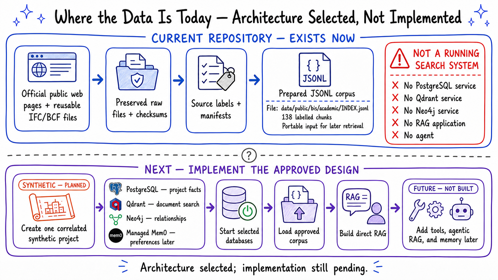

The word “index” in the filename `INDEX.jsonl` means an ordered JSON Lines file prepared for later retrieval. It does **not** mean that Qdrant, RAG, or an agent is running. The target database architecture has now been selected, but none of its services has been started or loaded.

### Product mockup: data library

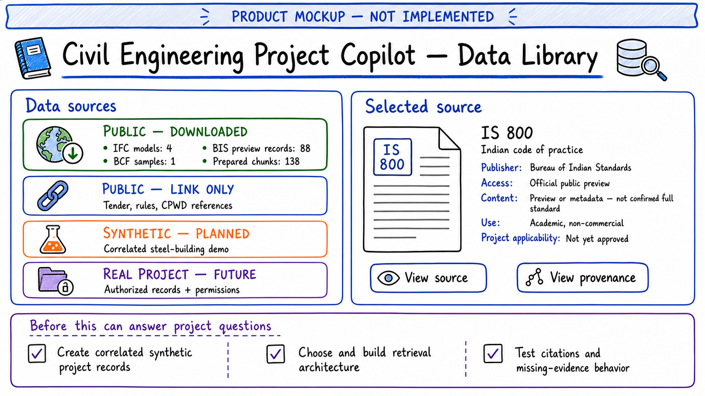

*Status: product mockup — not implemented. It demonstrates how a reviewer could inspect source provenance, licence/use labels, and project applicability before trusting a result.*

### Planned synthetic project layer

The academic demo will create one internally consistent, clearly labelled synthetic project. Its records will share controlled identifiers so that the submission can demonstrate correlation without inventing links between unrelated public datasets. The minimum chain is:

> adopted-code register → design basis → drawing revisions → RFI and approval → schedule activity → material delivery → inspection/NCR → accepted work

Every synthetic record and every diagram using it must display `SYNTHETIC — ACADEMIC DEMO`.

### Information domains

- **Governance and requirements:** project scope, contracts, employer requirements, applicable codes, local approvals, permits, specifications, and design criteria
- **Design and document control:** calculations, drawing/document registers and revisions, CAD/BIM/IFC, model issues, RFIs, submittals, transmittals, and decisions
- **Project controls and commercial:** WBS/CBS, schedule and baselines, progress, BOQ, costs, changes, claims, and risks
- **Procurement and delivery:** vendors, requisitions, purchase orders, fabrication, expediting, shipping, receipts, and material traceability
- **Field, quality, and safety:** daily reports, manpower/equipment, installed quantities, photos, surveys, inspections, tests, NCRs, welding/NDT, and HSE records
- **Commissioning and handover:** systems/assets, test packs, punch closure, as-built information, O&M manuals, warranties, and acceptance records

### Candidate source systems and access methods

Autodesk Construction Cloud, Procore, SharePoint/OneDrive, Primavera P6, Microsoft Project, ERP/QMS/HSE platforms, email archives, common data environments, and controlled project folders are **source systems**, not information domains. Data may be acquired through authorized APIs, webhooks, native exports, database views, or controlled file drops. The pilot must identify the authoritative system and precedence rule for every record type before ingestion.

### Proposed future ingestion process — not implemented

1. **Acquire:** Connector jobs use supported APIs, exports, webhooks, or monitored file drops. Each item receives a stable source ID and sync timestamp.
2. **Preserve:** Original files and source payloads are preserved in controlled local folders for the academic pilot. Checksums prevent accidental duplicate processing; the same references can later move to S3-compatible storage.
3. **Parse:** Text, tables, headings, page coordinates, and attachments are extracted. Scanned pages use OCR. Native structured exports are preferred over PDF when available.
4. **Normalize:** Records are mapped to a common project schema: project, document type, identifier, discipline, location, status, author, dates, revision, source URL, and permissions.
5. **Version:** Revisions remain separate and are linked through `REVISES` / `SUPERSEDES` relationships. The current authoritative version is explicitly marked.
6. **Chunk:** Content is split using document-aware rules rather than one fixed token window.
7. **Load for retrieval:** Trusted chunks receive embeddings and enter Qdrant with exact-word, full-text, meaning-based, and filterable metadata fields.
8. **Link:** Entities and relationships are extracted into the project graph, with provenance and confidence recorded for every inferred link.
9. **Validate:** Failed parses, missing metadata, low-confidence links, and permission mismatches enter a review queue.

### Chunking strategy by source

| Source | Chunking unit |
|---|---|
| Specifications / contracts | Section, clause, and table; retain heading hierarchy and page number |
| RFIs / submittals | One record plus question, response, status history, and attachment references |
| Meeting minutes | Agenda item or issue, with meeting date and participants |
| Reports / correspondence | Semantic paragraph groups with modest overlap |
| Schedules | One activity or milestone as a structured record; do not flatten into prose |
| Drawings | Sheet, note block, callout, and OCR/layout region with coordinates |
| BIM/IFC | Entity/property records and relationships; geometry remains in the source model initially |

## 7. High-Level System Architecture

> **Architecture status:** The figures in this section show the approved target design. They explain responsibilities and information flow; they do not claim that the named components are running.

### Architecture input sources

| Source group | Project data entering the ingestion plane |
|---|---|
| Governance and requirements | Scope, contracts, applicable-code register, local approvals, specifications, design criteria, and project breakdowns |
| Design and technical workflows | Calculations, drawings/revisions, BIM/IFC, model issues, RFIs, submittals, shop drawings, ITPs, transmittals, and decisions |
| Planning, cost, and commercial | WBS/CBS, schedules/baselines, progress, BOQ, budgets, actuals, forecasts, changes, claims, and risks |
| Procurement and materials | Vendors, POs, fabrication, logistics, receipts, material certificates, heat/batch records, and installed-item traceability |
| Field, quality, and HSE | Daily reports, quantities, photographs, surveys, inspections, tests, welding/NDT, NCRs, corrective actions, and safety records |
| Handover and operations | Systems/assets, commissioning evidence, punch closure, as-builts, O&M manuals, warranties, and acceptance |

Connector products sit outside this classification. They provide access to one or more source groups through APIs, exports, webhooks, or controlled file drops.

The architecture has two distinct planes:

- The **offline data plane** continuously turns fragmented project records into trusted, versioned knowledge.
- The **online question plane** routes each question through the minimum reasoning and retrieval needed to build a cited answer.

Within the online plane, retrieval, agents, and tools are separate responsibilities: **agents choose, tools execute, and retrieval builds evidence**.

> **Figure status: PROPOSED — NOT IMPLEMENTED.**

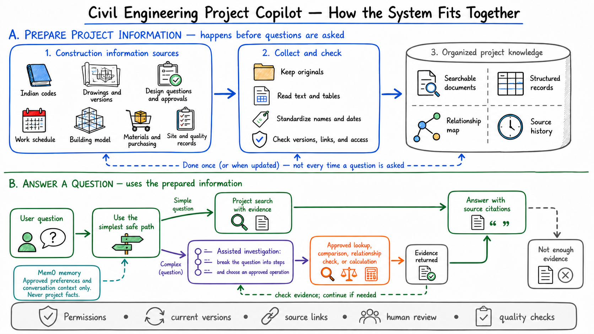

*Status: proposed system behavior — not implemented. Data preparation and question answering are intentionally separate.*

> **Figure status: APPROVED TARGET ARCHITECTURE — NOT IMPLEMENTED.**

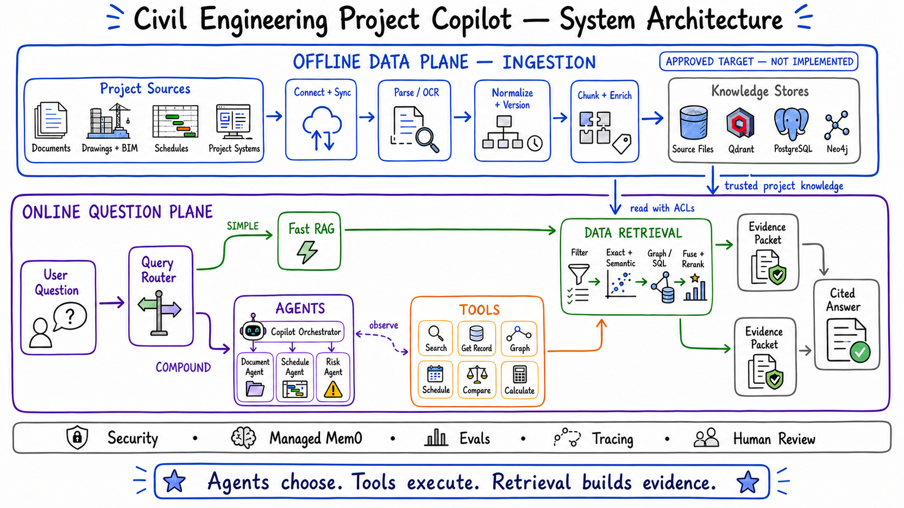

*Status: approved target architecture — not implemented. The data-origin figure in Section 6 governs what data actually exists.*

### 7.1 Data ingestion — offline write path

Data ingestion is an asynchronous, repeatable pipeline. It acquires records from project sources, preserves originals, extracts content, normalizes metadata, tracks revisions, applies document-aware chunking, and publishes permission-aware knowledge. Failed parses and uncertain entity links go to a validation queue rather than silently entering the trusted indexes.

> **Figure status: PROPOSED PRODUCTION INGESTION — NOT IMPLEMENTED.**

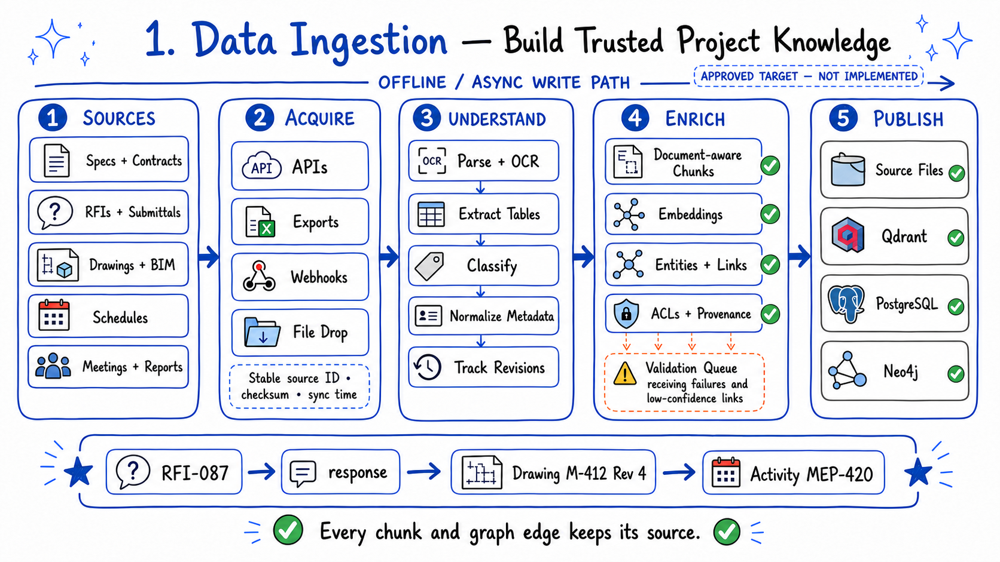

*Status: proposed production ingestion design — not the current repository pipeline. The actual current path is the file-based preparation figure in Section 6.*

Key outputs are deliberately different:

- **Controlled local files initially:** preserved originals and parsed artifacts; S3-compatible storage can replace this later without changing source references
- **Qdrant:** exact keyword/full-text fields, dense embeddings, metadata filters, hybrid retrieval, and chunk provenance
- **PostgreSQL:** normalized records, schedules, users, ingestion state, and audit data
- **Neo4j:** provenance-backed project entities and dependency relationships

### 7.2 Data retrieval — online evidence path

Retrieval begins only after project scope and document permissions are known. The service extracts exact identifiers and metadata constraints, runs the appropriate retrieval methods, fuses and reranks candidates, and returns a structured evidence packet—not an answer.

> **Figure status: PROPOSED RAG — NOT IMPLEMENTED.**

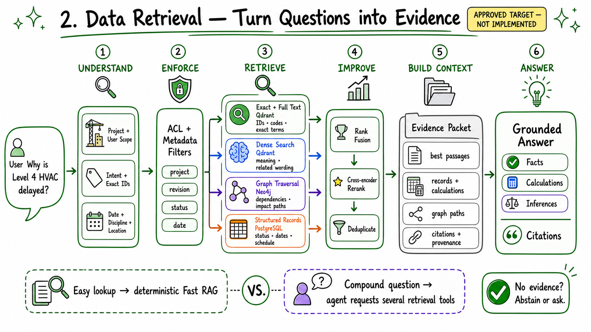

*Status: proposed RAG/retrieval design — not implemented.*

The evidence packet contains the best passages, authoritative records, deterministic calculations, graph paths, and citation metadata. A simple lookup can use this service directly through Fast RAG. A compound investigation can call it several times through agent tools with different sub-questions and filters.

> **Figure status: PROPOSED ROUTING — NOT IMPLEMENTED.**

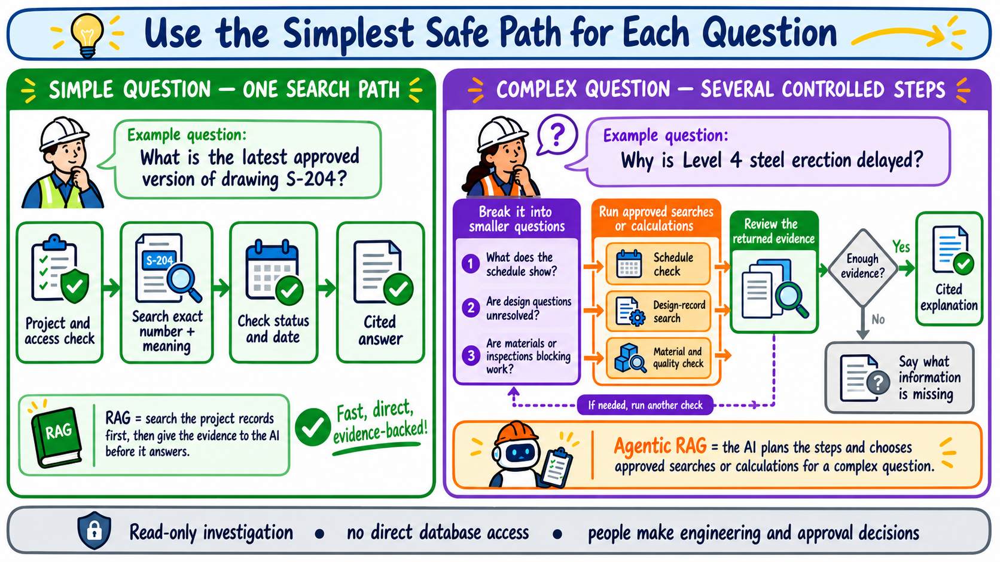

*Status: proposed routing behavior. The left path is the first implementation target; the agentic path is later and must prove an improvement over direct RAG.*

### 7.3 Agents — reasoning and coordination

> **Deferred implementation:** This section describes the target architecture only. No agent code is part of the Data Foundation phase. Correlation must first be proven with source reconciliation, deterministic rules, and expert review.

The query router is deterministic and sends simple questions to Fast RAG. Compound questions enter a bounded LangGraph/ReAct workflow led by the Copilot Orchestrator. Specialist agents are narrow roles, not independent sources of truth:

- **Document Agent:** specifications, RFIs, submittals, minutes, and requirements
- **Schedule Agent:** activities, float, blockers, milestones, and scenario impact
- **Risk Agent:** evidence-backed synthesis and ranking of validated issues

> **Figure status: FUTURE AGENTIC RAG — NOT BUILT.**

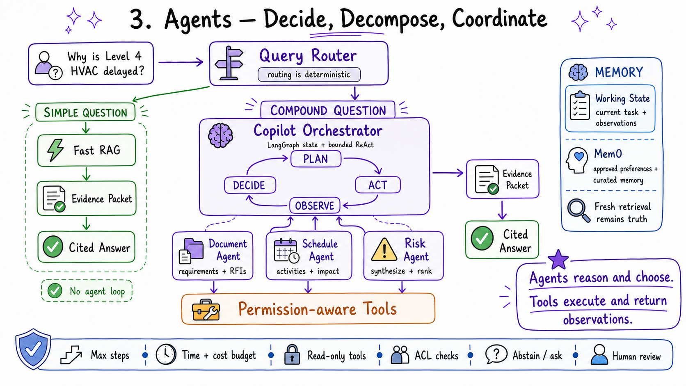

*Status: future Agentic RAG design — no router, orchestrator, specialist agent, LangGraph workflow, or Mem0 integration has been built.*

Agents can plan, decompose, select tools, inspect observations, and stop. They cannot bypass permission checks, access databases directly, or treat memory as authoritative project data. Working state remains in workflow checkpoints; Mem0 contributes only approved preferences and curated memory.

### 7.4 Tools — controlled execution

Tools are deterministic, typed, permission-aware capabilities. They validate inputs, execute one bounded operation, and return a structured observation containing results, source identifiers, citations, confidence/errors, and timing.

> **Figure status: FUTURE READ-ONLY TOOLS — NOT BUILT.**

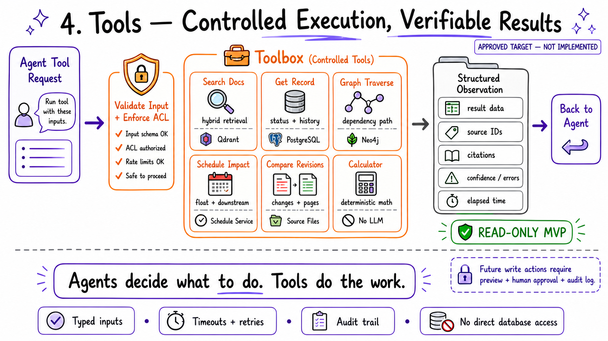

*Status: future read-only tool design — no tool service has been built.*

The MVP tool catalog is read-only: document search, record lookup, graph traversal, schedule impact analysis, revision comparison, and calculation. Future write actions require a preview, explicit human approval, and an audit record.

> **Figure status: RESPONSIBILITY MAP.** Only the limited file preparation exists today; search, graph, tools, agent, and memory are proposed or future.

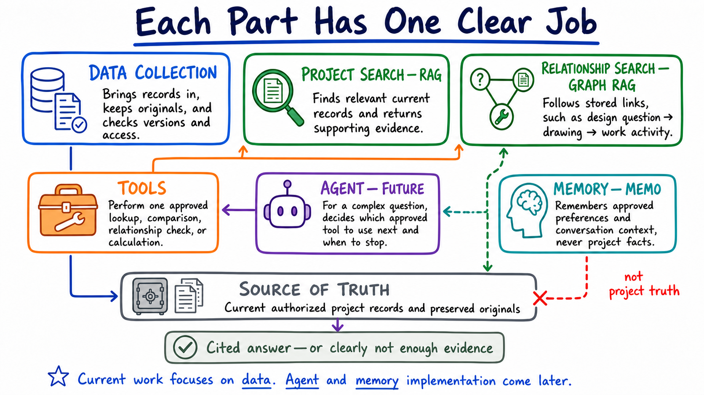

*Status: responsibility map, not implementation status. Data preparation exists only in the limited file-based form shown in Section 6; every other block is proposed or future.*

### End-to-end query flow

1. Resolve the project, user permissions, exact IDs, dates, disciplines, locations, and question type.
2. Route a simple question to deterministic Fast RAG or a compound question to the orchestrator.
3. Invoke only permission-aware tools; agents never query stores directly.
4. Run Qdrant hybrid retrieval, Neo4j graph traversal, or PostgreSQL structured queries as required.
5. Fuse, rerank, deduplicate, and assemble a compact evidence packet.
6. Generate an answer that visibly separates sourced facts, calculations, and model inferences.
7. Return claim-level citations and a concise investigation trace; abstain or ask when evidence is insufficient.

## 8. How the Week 2 Concepts Fit

| Concept | Concrete role in the Copilot |
|---|---|
| RAG foundations | Ground answers in external project records rather than model memory |
| Chunking | Preserve clauses, RFI exchanges, agenda items, drawing regions, and their parent context |
| Embeddings / dense retrieval | Find semantically related content when users and documents use different wording |
| Sparse retrieval / BM25 | Find exact IDs, codes, sheet numbers, clauses, names, and uncommon technical terms |
| Hybrid retrieval | Combine dense and sparse results using rank fusion so neither exact nor semantic matches dominate incorrectly |
| Reranking | Apply a cross-encoder or reranking model to the fused candidates before context construction |
| Metadata filtering | Restrict by project, permission, source, discipline, location, status, revision, and date |
| Context engineering | Assemble only the best evidence, preserve provenance, order events, and separate facts from inference |
| Agentic RAG / ReAct | Let complex investigations plan, call a tool, inspect the observation, and decide the next bounded step |
| Tools | Provide controlled search, graph, schedule, SQL, document-diff, and calculation capabilities |
| Graph RAG | Retrieve explicit dependency paths that similarity search cannot reliably reconstruct |
| Memory | Retain current conversation scope and approved user preferences without treating old answers as project truth |
| Evals | Measure retrieval, grounding, task success, latency, cost, and permission enforcement continuously |

## 9. Project Knowledge Graph

The graph should represent the project's operational relationships, not just co-occurrence between text fragments.

### Example nodes

`Project`, `Document`, `Revision`, `Drawing`, `SpecificationSection`, `RFI`, `Submittal`, `Issue`, `Decision`, `Meeting`, `Activity`, `Milestone`, `Location`, `System`, `Asset`, `Organization`, and `Person`.

### Example relationships

`REVISES`, `SUPERSEDES`, `REFERENCES`, `RESPONDS_TO`, `REQUIRES`, `BLOCKS`, `DEPENDS_ON`, `AFFECTS`, `SCHEDULED_BEFORE`, `LOCATED_AT`, `ASSIGNED_TO`, `DISCUSSED_IN`, and `EVIDENCED_BY`.

For example:

```text
RFI-087 --BLOCKS--> Activity MEP-420
Activity MEP-420 --DEPENDS_ON--> Activity CEIL-430
Activity CEIL-430 --REQUIRED_FOR--> Milestone L4-COMPLETE
RFI-087 --REFERENCES--> Drawing M-412 Rev 4
RFI-087 --DISCUSSED_IN--> Coordination Meeting 2026-08-18
```

Each graph edge must store its source, extraction method, confidence, and effective dates. High-impact links should come from structured data or human confirmation; model-inferred links are visibly labeled. Graph traversal returns the path and evidence, enabling the user to verify an impact chain.

## 10. Technology Decisions and Open Choices

The project has fixed the application frameworks and operational approach below. This does not mean they are implemented; it means new design and code should use them consistently.

### Decisions now fixed

| Need | Selected technology | How it will be used |
|---|---|---|
| RAG components | **LangChain** | Document objects, loading/splitting adapters, embeddings, retrievers, prompts, models, and typed tools |
| Multi-step workflow | **LangGraph** | Explicit state, bounded steps, evidence checks, retry/stop rules, checkpoints, and later human approval |
| Observability and evaluations | **Langfuse Cloud initially** | Trace model calls, retrieval, tools, LangGraph steps, latency, cost, errors, and evaluation scores without adding the full self-hosted observability stack to the laptop |
| Local reproducibility | **Docker Compose** | Start the application and selected supporting services consistently for reviewers |
| Structured records | **PostgreSQL** | Authoritative RFIs, drawings, activities, revisions, permissions, ingestion state, audit data, and LangGraph checkpoints |
| Document and vector retrieval | **Qdrant, self-hosted** | Exact identifiers, full-text and meaning-based search, metadata filters, hybrid result fusion, and chunk provenance |
| Project relationship graph | **Neo4j Community** | Provenance-backed dependencies and multi-step paths between project records |
| Long-term user memory | **Mem0 Platform** | Managed preference and conversation memory using the available credits; never authoritative project facts |
| Original-file storage | **Controlled local folders initially** | Preserve public and synthetic originals for the academic pilot; keep source references portable to future S3-compatible storage |

Langfuse is the only project observability platform; LangSmith is not part of the planned stack. Docker Compose is the local and academic-demo deployment method for the application, PostgreSQL, Qdrant, and Neo4j. Mem0 and Langfuse are managed services for the first implementation. A production deployment can be reconsidered later.

### How the course repositories influence this project

- [Week 2 Session 1](https://github.com/The-Gen-Academy/Mastering-Agentic-AI-Week2-Session1) supplies the learning progression: basic RAG, metadata filtering, and hybrid vector-plus-BM25 retrieval.
- [Week 2 Session 2](https://github.com/The-Gen-Academy/Mastering-Agentic-AI-Week2-Session2) supplies the source-specific retriever-tool, question-routing, decomposition, tool-loadout, and Graph RAG patterns.
- The Session 2 Agentic RAG tutorial intentionally uses one LangChain `create_agent` without LangGraph. This project will keep that simple idea for narrowly scoped routing, while using LangGraph where a construction investigation needs explicit state, limits, evidence checks, interruption, or approval.
- Tutorial storage choices such as Pinecone and Chroma remain examples. This project instead uses self-hosted Qdrant for retrieval and Neo4j Community for graph traversal.

### Choices still open

The remaining table contains implementation details that do not need to be fixed before the synthetic corpus and database contracts are designed. The background queue and remote object storage should be added only when a demonstrated workload requires them.

| Layer | Candidate technology | Rationale |
|---|---|---|
| Web experience | Next.js / React | Familiar document-centric UI, streaming answers, evidence panels, and graph views |
| API and services | Python, FastAPI, Pydantic | Strong document/AI ecosystem and explicit typed service contracts |
| Parsing / OCR | Docling or Unstructured, PyMuPDF, OCR engine | Layout-aware extraction with source coordinates; adapters keep parsers replaceable |
| Future models | Provider-neutral model gateway | Deferred; later allows hosted or private LLM, embedding, and reranking models based on data policy |
| Background work | Direct jobs initially; Redis-backed worker only when needed | Avoid another service until scheduled synchronization, retryable OCR, or parallel ingestion demonstrates the need |
| Future object storage | S3-compatible storage | Add only when uploads, larger collections, or remote deployment outgrow controlled local folders |

The selected databases have separate jobs: PostgreSQL stores authoritative structured facts, Qdrant finds document evidence, Neo4j follows project relationships, and Mem0 remembers approved user preferences. The same fact may have search or graph representations, but every representation must point back to its PostgreSQL record or preserved source file.

Production cloud and model providers should remain deployment decisions, because customer security, residency, and existing platform commitments may require AWS, Azure, GCP, or an on-premises environment.

## 11. Future Agent and Tool Boundaries

No agent or agent-facing tool exists today. After the correlated synthetic project and direct-RAG baseline work, a small read-only agentic demonstration can be added for the course submission. It must be compared with direct RAG rather than assumed to be better. Its candidate tools are:

- `search_documents(query, filters)`
- `get_record(type, id, as_of_date)`
- `query_project_graph(start, relationship_types, depth)`
- `analyze_schedule(activity_ids, scenario)`
- `compare_revisions(document_id, from_revision, to_revision)`
- `calculate(expression)`

The ReAct loop is bounded by maximum steps, time, and cost. Tool inputs are validated, every observation is logged, and the agent must stop or ask for clarification when project scope or identifiers are ambiguous. Any future write-back action requires a separate permission model, preview, explicit human approval, and audit record.

## 12. Future Memory Strategy

Mem0 Platform is the selected future memory service and will be evaluated after direct RAG works. The available managed credits are suitable for the academic demonstration. The authoritative project dataset, canonical mappings, and human-confirmed relationships belong in PostgreSQL, preserved files, and Neo4j—not in conversational memory.

- **Working memory:** Current conversation, active project, selected filters, and intermediate tool observations remain in LangGraph checkpoints/application storage.
- **User memory in Mem0:** Explicitly approved preferences such as default project, discipline, and answer detail persist across sessions.
- **Shared project preferences in Mem0:** Curated terminology and approved aliases can be shared within an approved project scope; relationship corrections remain governed records in PostgreSQL and Neo4j.
- **Not memory:** Previous generated answers are never promoted to project facts. Fresh retrieval remains the source of truth.

When the data foundation and deterministic baseline are complete, use the managed Mem0 account for a small memory experiment. Give each memory one appropriate stable entity scope: `user_id` for personal preferences or a project-specific `app_id` for curated shared preferences. Store organization, project, memory type, and provenance as metadata, and enforce project access before every memory read or write. Previous generated answers must never become project facts. Mem0's paid graph-memory feature is not required because Neo4j owns project relationships.

## 13. Evaluation and Safety

Evaluation starts with the data itself. Before retrieval or prompts are tuned, measure source reconciliation, identity coverage, revision completeness, relationship precision, provenance, and permission enforcement. Later, create a versioned retrieval set from real pilot questions covering exact lookup, semantic retrieval, multi-document synthesis, temporal/version questions, dependency traversal, unanswerable questions, and permission boundaries.

### Metrics

- Source-to-landing record, file, attachment, and revision reconciliation
- Required-field completeness, stable-ID coverage, duplicate rate, and referential integrity
- Current/superseded revision accuracy and temporal-history completeness
- WBS/CBS, package, discipline, location, asset, material, and activity mapping coverage
- Expert-reviewed precision and coverage of the priority relationship chains
- Provenance, checksum, license, and ACL completeness
- Retrieval Recall@k, MRR/nDCG, and exact-ID success
- Reranker improvement over hybrid retrieval alone
- Citation validity, citation coverage, and answer faithfulness
- Expert-rated correctness, completeness, and usefulness
- Graph-path accuracy and schedule calculation agreement
- Future agent tool-selection success and unnecessary-step rate
- p50/p95 latency, token usage, and cost per question
- Permission leakage rate and audit completeness

Safety controls include source-level access filtering, prompt-injection-resistant parsing, file scanning, tool allowlists, output citations, abstention when evidence is insufficient, and clear warnings for engineering, safety, commercial, and contractual judgments.

## 14. Phased Implementation Plan

### Phase 0 — Align the academic pilot and architecture

- Fix the synthetic India-based steel-building scope, names, dates, locations, work packages, and demonstration questions.
- Approve the data-origin and component-status legend used throughout this proposal.
- Use the approved PostgreSQL + Qdrant + Neo4j data stack; keep agent and memory implementation as later phases.
- Define a fictional adopted-code register for the synthetic project and label it as demonstration data. Do not present it as a professional compliance decision.

### Phase 1 — Complete public collection and create correlated synthetic data

- Preserve the downloaded public originals, manifests, checksums, source URLs, licences, and content-scope labels.
- Create the synthetic drawing register/revisions, RFIs/approvals, schedule/progress, materials, inspections, NCRs, and handover records as one coherent project.
- Give every synthetic record an explicit data-origin label and stable cross-record identifiers.
- Deliberately include a few missing, conflicting, superseded, and access-restricted cases for evaluation.

### Phase 2 — Normalize and correlate

- Establish the canonical project, organization, WBS/CBS, package, location, asset, document, activity, cost, vendor, material, inspection, and code identifiers.
- Apply authoritative and deterministic relationships first; keep rule-assisted links reviewable and model-suggested links untrusted.
- Reconcile the synthetic current/superseded revisions, schedule relationships, quantities, material traceability, and approval/inspection chains against the synthetic ground truth.
- Gate completion on the data-readiness measures in [Data Foundation](docs/DATA_FOUNDATION.md).

### Phase 3 — Deterministic retrieval and evidence evaluation

- Load only trusted, versioned, permission-aware records and provenance-backed relationships into the selected retrieval layer.
- Evaluate exact-ID lookup, metadata filtering, hybrid retrieval, reranking, graph paths, citations, and `as_of_date` behavior.
- Build an expert-reviewed question/evidence set and inspect retrieved evidence without an agent loop.
- Establish the deterministic quality, latency, and permission baseline.

### Phase 4 — Tools, then optional agents

- Add read-only document, record, graph, schedule, comparison, and calculation tools only after the data contracts are stable.
- Build one bounded Agentic RAG/ReAct demonstration for a multi-step delay or impact question after direct RAG works.
- Require measurable improvement over the deterministic baseline before retaining agent workflows.
- Evaluate Mem0 only for approved preferences and conversation continuity, never as project truth.

### Phase 5 — Future authorized-project validation

- Replace synthetic project records with an authorized, permission-controlled pilot extract while keeping the same schemas and evaluations.
- Reconfirm the actual project's adopted Indian codes, editions, amendments, authority rules, and order of precedence with qualified professionals.
- Add live connectors, incremental updates, and broader asset modules only after the steel-work-package slice succeeds.

## 15. Success Criteria

Initial targets should be finalized during Phase 0. The synthetic Data Foundation is ready for deterministic retrieval when:

- 100% of published records retain source system, source ID, checksum/version, timestamps, and ACL scope.
- Every in-scope record type has a defined source and precedence rule within the synthetic ground truth.
- At least **95% identity coverage** is achieved for in-scope records.
- At least **90% WBS/package, discipline, and location coverage** is achieved where applicable.
- Current and superseded document revisions reconcile with source registers.
- Schedule activities, relationships, baselines, and data dates reconcile with the approved authoritative export.
- At least **90% expert-reviewed precision** is achieved for the priority correlation chains.
- No model-suggested relationship is published as trusted data without confirmation.
- Zero cross-project or unauthorized-record leakage occurs in the test dataset, including deliberately restricted synthetic records.

Later retrieval and product targets are:

- At least **90% exact-ID retrieval success** for known RFIs, submittals, activities, and drawing identifiers.
- At least **85% gold-evidence Recall@10** across the evaluation set.
- At least **90% of material answer claims have a supporting citation**, with no unsupported high-impact conclusion presented as fact.
- At least **80% of pilot answers are rated correct and useful** by project professionals.
- Zero cross-project or unauthorized-document retrieval in permission test suites.
- p95 response time below **8 seconds for simple RAG** and **30 seconds for bounded agentic investigations**.
- At least **30% reduction in median time-to-answer** for the selected pilot workflows.

## 16. Open Questions and Risks

### Questions to resolve during discovery

1. What exact synthetic building, location, timeline, and structural-steel package should anchor the academic demo?
2. Which record types are authoritative, and how are superseded documents marked today?
3. Which future India-based project could later supply an authorized validation package?
4. Which state/UT, ULB, fire authority, contract, and design date determine the applicable code register?
5. Which project/WBS/CBS/location/asset identifiers can serve as the correlation spine across systems?
6. Which roles and record-level permissions must be preserved?
7. Which export/API limitations prevent full revision, attachment, schedule, cost, or status history from being collected?
8. Is the imported schedule authoritative, and which export preserves the required baselines and relationships?
9. Which high-value correlations are explicitly stored today, and which require mapping or human validation?

### Principal risks and mitigations

| Risk | Mitigation |
|---|---|
| Poor scans, tables, and drawing extraction | Prefer native exports, preserve page coordinates, measure parser quality, and provide a review queue |
| Wrong or superseded evidence | Explicit revision model, effective dates, authoritative-source rules, and default current-version filters |
| Incorrect entity links | Provenance and confidence on edges; human verification for high-impact links |
| Hallucinated conclusions | Evidence-only prompts, claim-level citations, abstention, and deterministic calculations |
| Permission leakage | Apply source ACLs before retrieval and include adversarial permission tests |
| Agentic capability is absent from the course submission | Create the correlated synthetic project, direct-RAG baseline, and one bounded multi-step agent demonstration in that order |
| Weak evaluation data | Build the expert-reviewed question set before optimization and expand it from pilot failures |
| Liability or overreliance | Clear decision-support positioning, user verification, audit trails, and no autonomous field actions |

## 17. Recommended Starting Point

Begin with one clearly labelled synthetic India-based project and one coherent **data chain**:

> **For one structural-steel work package, connect the governing code and specification to design calculations, drawing/model revisions, RFIs and approvals, BOQ/procurement and material traceability, schedule/progress, fabrication/erection, inspections/NDT/NCRs, and handover evidence.**

This vertical slice first proves collection completeness, version history, canonical identifiers, end-to-end correlations, permissions, and provenance. Then build direct RAG, followed by read-only tools and one bounded agentic demonstration. A later authorized-project pilot validates whether the academic design works with real operational data.

## Technology References

- [Week 2 Session 1 course repository](https://github.com/The-Gen-Academy/Mastering-Agentic-AI-Week2-Session1)
- [Week 2 Session 2 course repository](https://github.com/The-Gen-Academy/Mastering-Agentic-AI-Week2-Session2)
- [LangChain documentation](https://docs.langchain.com/oss/python/langchain/overview)
- [LangGraph overview](https://docs.langchain.com/oss/python/langgraph/overview)
- [Langfuse LangChain and LangGraph integrations](https://langfuse.com/integrations)
- [Langfuse Docker Compose self-hosting](https://langfuse.com/self-hosting/deployment/docker-compose)
- [Docker Compose documentation](https://docs.docker.com/compose/)
- [Qdrant hybrid search](https://qdrant.tech/documentation/search/hybrid-queries/)
- [Qdrant text and exact-keyword filtering](https://qdrant.tech/documentation/search/text-search/text-filtering/)
- [Qdrant local Docker quickstart](https://qdrant.tech/documentation/quick-start/)
- [PostgreSQL full-text search](https://www.postgresql.org/docs/current/textsearch.html)
- [Neo4j path-finding documentation](https://neo4j.com/docs/graph-data-science/current/algorithms/pathfinding/)
- [Mem0 entity-scoped memory](https://docs.mem0.ai/platform/features/entity-scoped-memory)
- [Mem0 pricing](https://mem0.ai/pricing)
