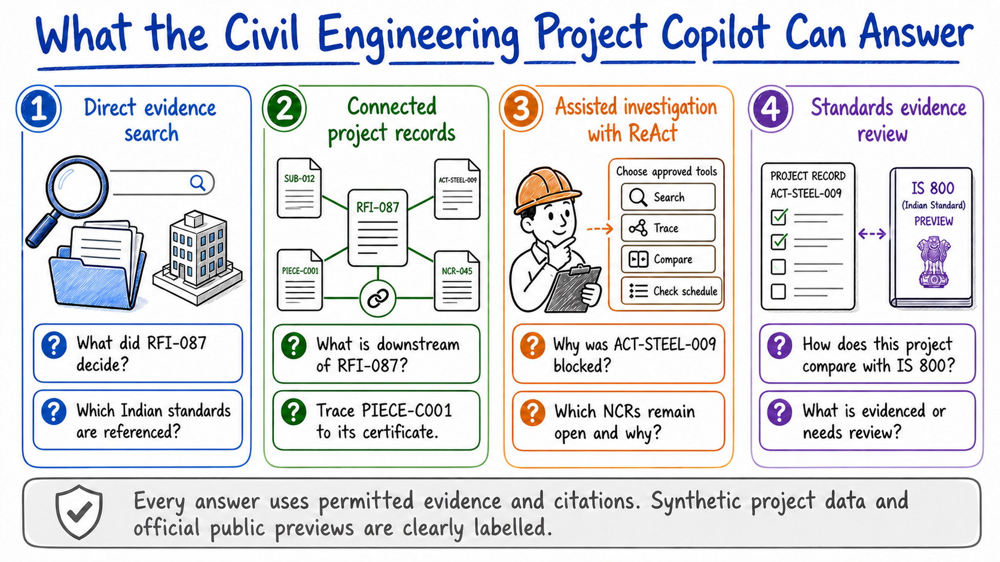
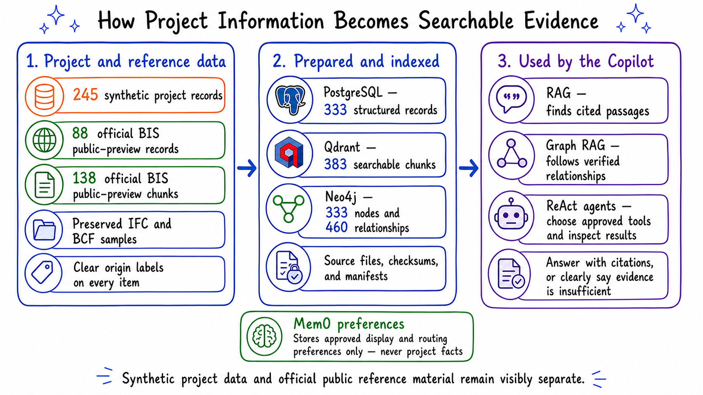
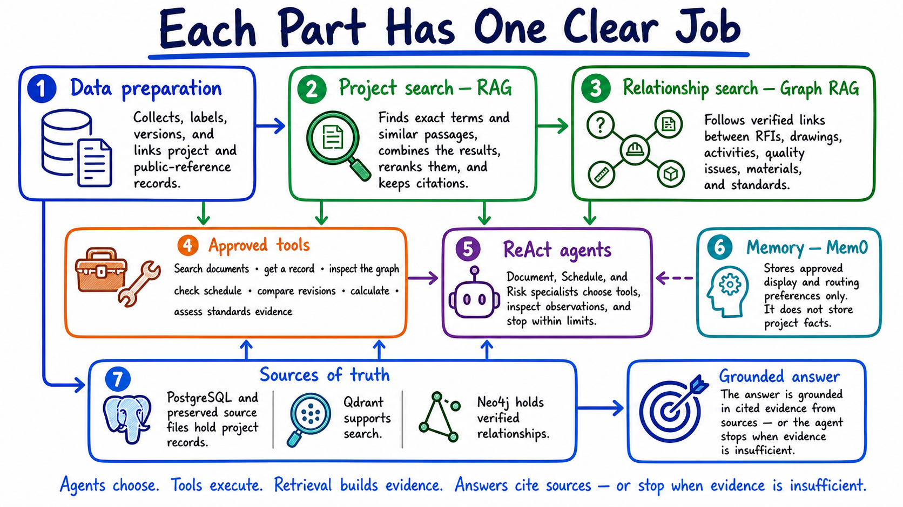

# Civil Engineering Project Copilot — High-Level Proposal

**Document date:** 23 August 2026
**Pilot focus:** India-based building / structural-steel academic demonstration

> **How to read this proposal:** The repository is a working academic pilot with PostgreSQL, Qdrant, Neo4j, RAG, Graph RAG, bounded ReAct agents, typed read-only tools, controlled Mem0 preferences, evaluations, FastAPI, and Streamlit. Only explicitly named production extensions are future work. Project records are synthetic and clearly labelled; BIS material is an official public preview, not the full Indian Standard.

## 1. Executive Summary

Civil engineering projects generate large amounts of fragmented, versioned information across drawings, specifications, RFIs, submittals, schedules, contracts, meeting minutes, inspections, BIM models, and field reports. Teams lose time finding the authoritative source, connecting related records, and understanding how one issue affects downstream work.

The **Civil Engineering Project Copilot** is an evidence-first academic pilot that retrieves project information, connects related records, and explains its conclusions with citations. It combines conventional RAG, hybrid retrieval, controlled tools, and a project relationship map. Simple questions use direct retrieval; complex questions use a bounded Agentic RAG workflow.

The repository contains one **correlated synthetic India-based steel-building project** connected to clearly separated official public reference material. This provides enough controlled data to demonstrate direct RAG, relationships, tools, and agents without claiming that unrelated public samples form one real project. A future real-project pilot would validate the same design using authorized records.

### What the repository contains

| Item | What is included |
|---|---|
| Four buildingSMART IFC models and one BCF sample | **Public — downloaded**; reusable technical samples, but not one Indian project |
| BIS catalogue/search and public preview pages | **Public — downloaded** from official pages |
| `data/public/bis/academic/INDEX.jsonl` | 138 labelled chunks in the portable corpus and Qdrant collection |
| Guwahati tender, Assam rules, and CPWD references | **Public — link only**; catalogued but not copied into the repository |
| Correlated steel-building RFIs, revisions, schedule, materials, and inspections | **Synthetic — academic demo**; 245 labelled project records |
| Application stack | PostgreSQL, Qdrant, Neo4j, RAG, Graph RAG, ReAct agents, seven read-only tools, Mem0 preferences, FastAPI, Streamlit, Langfuse tracing, and evaluations |

**Terminology note:** IS 800 is an Indian Standard and a structural-steel **code of practice**. It is not a “code of conduct,” which normally describes professional behavior. In this proposal, the umbrella label is **Indian codes and standards**.

## 2. Problem Statement

Project information is distributed across systems and file formats, often with inconsistent naming, duplicate records, and multiple revisions. Traditional keyword search can find a document but usually cannot answer questions that require:

- combining evidence from several sources;
- resolving exact identifiers such as `RFI-087` or `S-204 Rev 5`;
- determining which version was valid at a specific date;
- tracing dependencies between an RFI, a drawing, an activity, and a milestone;
- calculating schedule or downstream impact; or
- explaining an answer in a form that a project professional can verify.

The result is avoidable search time, slower issue resolution, weak organizational memory, and late discovery of project risk. The Copilot should reduce this burden without presenting model-generated advice as an authoritative engineering decision.

## 3. Target Users

| User | Primary need |
|---|---|
| Project manager | Understand status, blockers, dependencies, and emerging risks |
| Project engineer | Find requirements, RFIs, submittals, and drawing references quickly |
| Scheduler / planner | Trace issues to activities, milestones, float, and critical-path impact |
| Design manager / discipline lead | Compare revisions and follow cross-discipline dependencies |
| Superintendent / field engineer | Get current, field-relevant answers with source evidence |
| Owner / program manager | Obtain concise, auditable summaries across projects |

## 4. Product Vision and Principles

The Copilot should function as a **project investigation partner**, not merely a chat interface over files.

1. **Evidence before eloquence:** Every material claim should point to a source page, record, schedule activity, or graph path.
2. **Right method for the question:** Use exact search, semantic search, structured calculation, or graph traversal as appropriate.
3. **Fast path before agent path:** Do not invoke a multi-step agent when one retrieval pass can answer the question.
4. **Version and time awareness:** Preserve document revisions, effective dates, superseded status, and record history.
5. **Permission-aware by design:** Retrieval must enforce the source system's project and document access rules.
6. **Human accountability:** The system supports investigation and decision-making; it does not approve designs, direct field work, or make contractual determinations.

### Initial non-goals

- Autonomous engineering or safety decisions
- Automatic changes to schedules, RFIs, or source systems
- Full CAD/BIM geometric reasoning in the first release
- Unbounded autonomous agents or agents with direct database access
- Organization-wide rollout before a single-project pilot succeeds

## 5. Flagship Use Cases

The pilot demonstrates four complementary ways to investigate the same project: direct evidence search, connected-record analysis, bounded ReAct investigation, and standards-evidence review.



| Question | Required behavior |
|---|---|
| “What does the specification require for concrete curing?” | Retrieve the correct specification section and answer with page/section citations |
| “Show the current status of RFI-087 and the latest response.” | Use exact-ID retrieval, revision/status metadata, and attachments |
| “Why is Level 4 HVAC delayed?” | Combine schedule data, RFIs, meeting minutes, and dependency evidence |
| “Which unresolved RFIs affect critical-path activities?” | Query RFI status, traverse RFI-to-activity links, and run schedule logic |
| “What changed between S-204 Rev 3 and Rev 5?” | Compare authoritative revisions and cite the changed sheets/regions |
| “What happens if RFI-087 remains unresolved for two more weeks?” | Traverse downstream dependencies and calculate schedule scenarios |
| “What are the top current project risks?” | Produce a ranked, evidence-backed summary and clearly label inferred risks |
| “Compare this project's steel practices with the indexed IS 800 preview.” | Check seven preview-supported topics against project records; label each `Evidenced`, `Needs review`, `Not evidenced`, or `Not applicable`, and state why the preview cannot establish full compliance |

### Product mockup: a direct evidence answer


*This is an early interface concept. The Streamlit workspaces use the correlated academic demo records and the same evidence-first presentation rule.*

## 6. Data Sources and Ingestion

The detailed discovery inventory is maintained in [Data Foundation](docs/DATA_FOUNDATION.md). Execution uses the [Data Collection Register](docs/DATA_COLLECTION_REGISTER.md), [Correlation Matrix](docs/CORRELATION_MATRIX.md), and [Pilot Data Handoff Checklist](docs/PILOT_DATA_HANDOFF.md). Applicable Indian regulatory and standards sources are maintained separately in the [Indian Standards Register](docs/INDIAN_STANDARDS_REGISTER.md). Actual reusable and link-only research sources are assessed in the [Public Data Catalogue](docs/PUBLIC_DATA_CATALOG.md).

### Data origin and availability


This is the authoritative visual summary of data origin. In particular:

- BIS material is labelled **Indian codes and standards — official public previews**;
- no public preview is silently represented as the complete standard;
- the synthetic steel-building project is generated locally and clearly labelled, not downloaded; and
- authorized real-project data remains a future validation layer.

### How project information becomes searchable evidence



The corpus contains 245 correlated synthetic project records and 88 official BIS public-preview records. In the full prepared corpus, PostgreSQL holds 333 structured records, Qdrant holds 383 searchable chunks, and Neo4j holds 333 nodes with 460 provenance-backed relationships. The portable mode builds equivalent in-process stores for notebooks and tests. Mem0 remains separate and stores approved user preferences only—not project facts.

### Product mockup: data library


*This interface concept shows how a reviewer can inspect source provenance, licence/use labels, and project applicability before trusting a result.*

### Correlated synthetic project layer

The academic demo contains one internally consistent, clearly labelled synthetic project. Its records share controlled identifiers so that the submission demonstrates correlation without inventing links between unrelated public datasets. Its main evidence chain is:

> adopted-code register → design basis → drawing revisions → RFI and approval → schedule activity → material delivery → inspection/NCR → accepted work

Every synthetic record and every diagram using it must display `SYNTHETIC — ACADEMIC DEMO`.

### Information domains

- **Governance and requirements:** project scope, contracts, employer requirements, applicable codes, local approvals, permits, specifications, and design criteria
- **Design and document control:** calculations, drawing/document registers and revisions, CAD/BIM/IFC, model issues, RFIs, submittals, transmittals, and decisions
- **Project controls and commercial:** WBS/CBS, schedule and baselines, progress, BOQ, costs, changes, claims, and risks
- **Procurement and delivery:** vendors, requisitions, purchase orders, fabrication, expediting, shipping, receipts, and material traceability
- **Field, quality, and safety:** daily reports, manpower/equipment, installed quantities, photos, surveys, inspections, tests, NCRs, welding/NDT, and HSE records
- **Commissioning and handover:** systems/assets, test packs, punch closure, as-built information, O&M manuals, warranties, and acceptance records

### Candidate source systems and access methods

Autodesk Construction Cloud, Procore, SharePoint/OneDrive, Primavera P6, Microsoft Project, ERP/QMS/HSE platforms, email archives, common data environments, and controlled project folders are **source systems**, not information domains. Data may be acquired through authorized APIs, webhooks, native exports, database views, or controlled file drops. The pilot must identify the authoritative system and precedence rule for every record type before ingestion.

### Proposed future ingestion process — not implemented

1. **Acquire:** Connector jobs use supported APIs, exports, webhooks, or monitored file drops. Each item receives a stable source ID and sync timestamp.
2. **Preserve:** Original files and source payloads are preserved in controlled local folders for the academic pilot. Checksums prevent accidental duplicate processing; the same references can later move to S3-compatible storage.
3. **Parse:** Text, tables, headings, page coordinates, and attachments are extracted. Scanned pages use OCR. Native structured exports are preferred over PDF when available.
4. **Normalize:** Records are mapped to a common project schema: project, document type, identifier, discipline, location, status, author, dates, revision, source URL, and permissions.
5. **Version:** Revisions remain separate and are linked through `REVISES` / `SUPERSEDES` relationships. The current authoritative version is explicitly marked.
6. **Chunk:** Content is split using document-aware rules rather than one fixed token window.
7. **Load for retrieval:** Trusted chunks receive embeddings and enter Qdrant with exact-word, full-text, meaning-based, and filterable metadata fields.
8. **Link:** Entities and relationships are extracted into the project graph, with provenance and confidence recorded for every inferred link.
9. **Validate:** Failed parses, missing metadata, low-confidence links, and permission mismatches enter a review queue.

### Chunking strategy by source

| Source | Chunking unit |
|---|---|
| Specifications / contracts | Section, clause, and table; retain heading hierarchy and page number |
| RFIs / submittals | One record plus question, response, status history, and attachment references |
| Meeting minutes | Agenda item or issue, with meeting date and participants |
| Reports / correspondence | Semantic paragraph groups with modest overlap |
| Schedules | One activity or milestone as a structured record; do not flatten into prose |
| Drawings | Sheet, note block, callout, and OCR/layout region with coordinates |
| BIM/IFC | Entity/property records and relationships; geometry remains in the source model initially |

## 7. High-Level System Architecture

The figures in this section describe the academic pilot directly. Production connectors, wider document parsing, human-approved write-back, and deployment against authorized project systems remain later extensions.

### Architecture input sources

| Source group | Project data entering the ingestion plane |
|---|---|
| Governance and requirements | Scope, contracts, applicable-code register, local approvals, specifications, design criteria, and project breakdowns |
| Design and technical workflows | Calculations, drawings/revisions, BIM/IFC, model issues, RFIs, submittals, shop drawings, ITPs, transmittals, and decisions |
| Planning, cost, and commercial | WBS/CBS, schedules/baselines, progress, BOQ, budgets, actuals, forecasts, changes, claims, and risks |
| Procurement and materials | Vendors, POs, fabrication, logistics, receipts, material certificates, heat/batch records, and installed-item traceability |
| Field, quality, and HSE | Daily reports, quantities, photographs, surveys, inspections, tests, welding/NDT, NCRs, corrective actions, and safety records |
| Handover and operations | Systems/assets, commissioning evidence, punch closure, as-builts, O&M manuals, warranties, and acceptance |

Connector products sit outside this classification. They provide access to one or more source groups through APIs, exports, webhooks, or controlled file drops.

The architecture has two distinct planes:

- The **offline data plane** continuously turns fragmented project records into trusted, versioned knowledge.
- The **online question plane** routes each question through the minimum reasoning and retrieval needed to build a cited answer.

Within the online plane, retrieval, agents, and tools are separate responsibilities: **agents choose, tools execute, and retrieval builds evidence**.


*The offline lane prepares trusted evidence; the online lane answers questions through retrieval, tools, and bounded agents. Production connectors and wider document parsing remain future breadth.*


*The data-origin figure in Section 6 governs which sources actually exist; the architecture keeps synthetic project data and official public previews visibly separate.*

### 7.1 Data ingestion — offline write path

Data ingestion is an asynchronous, repeatable pipeline. It acquires records from project sources, preserves originals, extracts content, normalizes metadata, tracks revisions, applies document-aware chunking, and publishes permission-aware knowledge. Failed parses and uncertain entity links go to a validation queue rather than silently entering the trusted indexes.


*This figure describes the future production ingestion breadth. The academic pilot uses the repeatable local generation and indexing path shown in Section 6.*

Key outputs are deliberately different:

- **Controlled local files initially:** preserved originals and parsed artifacts; S3-compatible storage can replace this later without changing source references
- **Qdrant:** exact keyword/full-text fields, dense embeddings, metadata filters, hybrid retrieval, and chunk provenance
- **PostgreSQL:** normalized records, schedules, users, ingestion state, and audit data
- **Neo4j:** provenance-backed project entities and dependency relationships

### 7.2 Data retrieval — online evidence path

Retrieval begins only after project scope and document permissions are known. The service extracts exact identifiers and metadata constraints, runs the appropriate retrieval methods, fuses and reranks candidates, and returns a structured evidence packet—not an answer.


*Exact, dense, hybrid, graph, and structured retrieval all return source-linked evidence for reranking and citation.*

The evidence packet contains the best passages, authoritative records, deterministic calculations, graph paths, and citation metadata. A simple lookup can use this service directly through Fast RAG. A compound investigation can call it several times through agent tools with different sub-questions and filters.


*Simple questions use direct RAG; compound questions use the bounded agent path. Route, tool, grounding, and citation evaluations check both paths.*

### 7.3 Agents — reasoning and coordination

The query router is deterministic and sends simple questions to Fast RAG. Compound questions enter a bounded LangGraph/ReAct workflow led by the Copilot Orchestrator. Specialist agents are narrow roles, not independent sources of truth:

- **Document Agent:** specifications, RFIs, submittals, minutes, and requirements
- **Schedule Agent:** activities, float, blockers, milestones, and scenario impact
- **Risk Agent:** evidence-backed synthesis and ranking of validated issues


*LangChain `create_agent`, its LangGraph runtime, typed tools, bounded execution, checkpoints, and controlled Mem0 preferences provide the agent path.*

Agents can plan, decompose, select tools, inspect observations, and stop. They cannot bypass permission checks, access databases directly, or treat memory as authoritative project data. Working state remains in workflow checkpoints; Mem0 contributes only approved preferences and curated memory.

### 7.4 Tools — controlled execution

Tools are deterministic, typed, permission-aware capabilities. They validate inputs, execute one bounded operation, and return a structured observation containing results, source identifiers, citations, confidence/errors, and timing.


*Every tool is typed, read-only, permission-aware, time-bounded, and available through the single registry.*

The MVP tool catalog is read-only: document search, record lookup, graph traversal, schedule impact analysis, revision comparison, calculation, and a standards-evidence review. Future write actions require a preview, explicit human approval, and an audit record.

The `assess_standard_evidence` tool compares the project only with topics visible in the indexed official BIS public preview. For IS 800:2007, the current checklist covers structural-steel scope, material references, welding, fabrication and erection, inspection and acceptance, loads, and seismic references. Each result keeps both provenance classes visible:

- project evidence is labelled `SYNTHETIC — ACADEMIC DEMO`;
- the standard source is labelled `official BIS public preview`;
- absence of a project record means **Not evidenced**, not non-compliance; and
- the preview is not the complete Indian Standard and cannot prove full compliance.

The graph uses an explicit designation-and-edition map for code links. For example, `CODE-IS-800` links to `PUBLIC-BIS-bis-800`. These links are never inferred from fuzzy text similarity.



### End-to-end query flow

1. Resolve the project, user permissions, exact IDs, dates, disciplines, locations, and question type.
2. Route a simple question to deterministic Fast RAG or a compound question to the orchestrator.
3. Invoke only permission-aware tools; agents never query stores directly.
4. Run Qdrant hybrid retrieval, Neo4j graph traversal, or PostgreSQL structured queries as required.
5. Fuse, rerank, deduplicate, and assemble a compact evidence packet.
6. Generate an answer that visibly separates sourced facts, calculations, and model inferences.
7. Return claim-level citations and a concise investigation trace; abstain or ask when evidence is insufficient.

## 8. How the Week 2 Concepts Fit

| Concept | Concrete role in the Copilot |
|---|---|
| RAG foundations | Ground answers in external project records rather than model memory |
| Chunking | Preserve clauses, RFI exchanges, agenda items, drawing regions, and their parent context |
| Embeddings / dense retrieval | Find semantically related content when users and documents use different wording |
| Sparse retrieval / BM25 | Find exact IDs, codes, sheet numbers, clauses, names, and uncommon technical terms |
| Hybrid retrieval | Combine dense and sparse results using rank fusion so neither exact nor semantic matches dominate incorrectly |
| Reranking | Apply a cross-encoder or reranking model to the fused candidates before context construction |
| Metadata filtering | Restrict by project, permission, source, discipline, location, status, revision, and date |
| Context engineering | Assemble only the best evidence, preserve provenance, order events, and separate facts from inference |
| Agentic RAG / ReAct | Let complex investigations plan, call a tool, inspect the observation, and decide the next bounded step |
| Tools | Provide controlled search, graph, schedule, SQL, document-diff, and calculation capabilities |
| Graph RAG | Retrieve explicit dependency paths that similarity search cannot reliably reconstruct |
| Memory | Retain current conversation scope and approved user preferences without treating old answers as project truth |
| Evals | Measure retrieval, grounding, task success, latency, cost, and permission enforcement continuously |

## 9. Project Knowledge Graph

The graph should represent the project's operational relationships, not just co-occurrence between text fragments.

### Example nodes

`Project`, `Document`, `Revision`, `Drawing`, `SpecificationSection`, `RFI`, `Submittal`, `Issue`, `Decision`, `Meeting`, `Activity`, `Milestone`, `Location`, `System`, `Asset`, `Organization`, and `Person`.

### Example relationships

`REVISES`, `SUPERSEDES`, `REFERENCES`, `RESPONDS_TO`, `REQUIRES`, `BLOCKS`, `DEPENDS_ON`, `AFFECTS`, `SCHEDULED_BEFORE`, `LOCATED_AT`, `ASSIGNED_TO`, `DISCUSSED_IN`, and `EVIDENCED_BY`.

For example:

```text
RFI-087 --BLOCKS--> Activity MEP-420
Activity MEP-420 --DEPENDS_ON--> Activity CEIL-430
Activity CEIL-430 --REQUIRED_FOR--> Milestone L4-COMPLETE
RFI-087 --REFERENCES--> Drawing M-412 Rev 4
RFI-087 --DISCUSSED_IN--> Coordination Meeting 2026-08-18
```

Each graph edge must store its source, extraction method, confidence, and effective dates. High-impact links should come from structured data or human confirmation; model-inferred links are visibly labeled. Graph traversal returns the path and evidence, enabling the user to verify an impact chain.

## 10. Technology Decisions and Open Choices

The academic pilot uses the application frameworks and operational approach below.

### Technology stack

| Need | Selected technology | How it is used |
|---|---|---|
| RAG components | **LangChain** | Document objects, loading/splitting adapters, embeddings, retrievers, prompts, models, and typed tools |
| Multi-step workflow | **LangGraph** | Explicit state, bounded steps, evidence checks, retry/stop rules, and durable PostgreSQL checkpoints |
| Observability and evaluations | **Langfuse Cloud** | Trace model calls, retrieval, tools, LangGraph steps, latency, cost, errors, and evaluation scores |
| Local reproducibility | **Docker Compose** | Start the application and selected supporting services consistently for reviewers |
| Structured records | **PostgreSQL** | Authoritative RFIs, drawings, activities, revisions, permissions, ingestion state, audit data, and LangGraph checkpoints |
| Document and vector retrieval | **Qdrant, self-hosted** | Exact identifiers, full-text and meaning-based search, metadata filters, hybrid result fusion, and chunk provenance |
| Project relationship graph | **Neo4j Community** | Provenance-backed dependencies and multi-step paths between project records |
| User preferences | **Mem0 Platform** | Approved display and routing preferences; never authoritative project facts |
| API and services | **Python, FastAPI, Pydantic** | Typed application contracts, health checks, retrieval, chat, tools, memory, and evaluation endpoints |
| Demonstration UI | **Streamlit** | Chat, impact exploration, revision evidence, quality review, tool traces, citations, and evaluation results |
| Original-file storage | **Controlled local folders initially** | Preserve public and synthetic originals for the academic pilot; keep source references portable to future S3-compatible storage |

Langfuse is the only project observability platform; LangSmith is not part of the stack. Docker Compose runs the application, PostgreSQL, Qdrant, and Neo4j locally. Mem0 and Langfuse are managed services for the academic pilot. A production deployment can be reconsidered later.

### How the course repositories influence this project

- [Week 2 Session 1](https://github.com/The-Gen-Academy/Mastering-Agentic-AI-Week2-Session1) supplies the learning progression: basic RAG, metadata filtering, and hybrid vector-plus-BM25 retrieval.
- [Week 2 Session 2](https://github.com/The-Gen-Academy/Mastering-Agentic-AI-Week2-Session2) supplies the source-specific retriever-tool, question-routing, decomposition, tool-loadout, and Graph RAG patterns.
- The Session 2 Agentic RAG tutorial intentionally uses one LangChain `create_agent` without a hand-written graph. This project uses that pattern for the Document, Schedule, and Risk specialists, while LangGraph supplies state, limits, evidence checks, interruption, and checkpoints.
- Tutorial storage choices such as Pinecone and Chroma remain examples. This project instead uses self-hosted Qdrant for retrieval and Neo4j Community for graph traversal.

### Choices still open

The remaining choices concern production breadth rather than the academic pilot. A background queue, richer parser stack, different web framework, or remote object storage should be added only when a demonstrated workload requires them.

| Layer | Candidate technology | Rationale |
|---|---|---|
| Future web experience | Next.js / React | Consider only if a production deployment outgrows Streamlit |
| Parsing / OCR | Docling or Unstructured, PyMuPDF, OCR engine | Layout-aware extraction with source coordinates; adapters keep parsers replaceable |
| Future models | Provider-neutral model gateway | Deferred; later allows hosted or private LLM, embedding, and reranking models based on data policy |
| Background work | Direct jobs initially; Redis-backed worker only when needed | Avoid another service until scheduled synchronization, retryable OCR, or parallel ingestion demonstrates the need |
| Future object storage | S3-compatible storage | Add only when uploads, larger collections, or remote deployment outgrow controlled local folders |

The selected databases have separate jobs: PostgreSQL stores authoritative structured facts, Qdrant finds document evidence, Neo4j follows project relationships, and Mem0 remembers approved user preferences. The same fact may have search or graph representations, but every representation must point back to its PostgreSQL record or preserved source file.

Production cloud and model providers should remain deployment decisions, because customer security, residency, and existing platform commitments may require AWS, Azure, GCP, or an on-premises environment.

## 11. Agent and Tool Boundaries

The read-only agent path is evaluated against direct RAG rather than assuming the longer path is better. Its registered tools are:

- `search_documents(query, filters)`
- `get_record(type, id, as_of_date)`
- `query_project_graph(start, relationship_types, depth)`
- `analyze_schedule(activity_ids, scenario)`
- `compare_revisions(document_id, from_revision, to_revision)`
- `calculate(expression)`
- `assess_standard_evidence(standard)`

The ReAct loop is bounded by maximum steps, time, and cost. Tool inputs are validated, every observation is logged, and the agent must stop or ask for clarification when project scope or identifiers are ambiguous. Any future write-back action requires a separate permission model, preview, explicit human approval, and audit record.

## 12. Memory Strategy

Mem0 Platform stores only approved, allowlisted user preferences for the academic demonstration. It does not store project facts, retrieved passages, or generated answers. The authoritative project dataset, canonical mappings, and human-confirmed relationships belong in PostgreSQL, preserved files, and Neo4j—not in conversational memory.

- **Working memory:** Current conversation, active project, selected filters, and intermediate tool observations remain in LangGraph checkpoints/application storage.
- **User memory in Mem0:** Explicitly approved preferences—units, answer style, citation detail, and preferred retrieval route—persist across sessions.
- **One current value, not an append-only history:** The application identifies a preference by three values: user, project, and preference type. PostgreSQL maps that three-part key to the ID created by Mem0. The first save creates the Mem0 memory; later saves call Mem0's update operation using the same ID.
- **Not memory:** Previous generated answers are never promoted to project facts. Fresh retrieval remains the source of truth.

The application chooses the preference fields and validates their values; Mem0 does not infer them from ordinary conversation. Each write uses `infer=False`, includes the user scope, and stores the project and preference type as metadata. This makes the behavior predictable for evaluation. Project access is checked before every memory read or write. Mem0's paid graph-memory feature is not required because Neo4j owns project relationships.

## 13. Evaluation and Safety

Evaluation starts with the data itself. The versioned scenario set covers exact lookup, semantic retrieval, multi-document synthesis, temporal/version questions, dependency traversal, standards evidence, unanswerable questions, and permission boundaries. Live evaluation can later add questions from an authorized project pilot.

### Metrics

- Source-to-landing record, file, attachment, and revision reconciliation
- Required-field completeness, stable-ID coverage, duplicate rate, and referential integrity
- Current/superseded revision accuracy and temporal-history completeness
- WBS/CBS, package, discipline, location, asset, material, and activity mapping coverage
- Expert-reviewed precision and coverage of the priority relationship chains
- Provenance, checksum, license, and ACL completeness
- Retrieval Recall@k, MRR/nDCG, and exact-ID success
- Reranker improvement over hybrid retrieval alone
- Citation validity, citation coverage, and answer faithfulness
- Expert-rated correctness, completeness, and usefulness
- Graph-path accuracy and schedule calculation agreement
- Agent tool-selection success, convergence, and unnecessary-step rate
- p50/p95 latency, token usage, and cost per question
- Permission leakage rate and audit completeness

Safety controls include source-level access filtering, prompt-injection-resistant parsing, file scanning, tool allowlists, output citations, abstention when evidence is insufficient, and clear warnings for engineering, safety, commercial, and contractual judgments.

## 14. Delivery Phases

### Phase 0 — Scope and architecture

- One India-based logistics steel-building project anchors the academic demonstration.
- Data-origin labels distinguish synthetic project records, official public previews, downloaded reusable samples, and link-only references.
- PostgreSQL, Qdrant, and Neo4j have separate authoritative-record, retrieval, and relationship responsibilities.
- The adopted-code register is fictional demonstration data and is never presented as a professional compliance decision.

### Phase 1 — Data foundation

- Public originals, manifests, checksums, source URLs, licences, and content-scope labels are preserved.
- Drawing revisions, RFIs, approvals, schedule/progress, materials, inspections, NCRs, and handover records form one coherent synthetic project.
- Stable identifiers connect records across domains while preserving their origin.
- Missing, conflicting, superseded, and access-restricted cases support evaluation.

### Phase 2 — Retrieval and relationships

- Canonical project, organization, package, location, document, activity, material, inspection, and code identifiers provide the correlation spine.
- Exact search, BM25, dense retrieval, hybrid fusion, metadata filters, reranking, graph traversal, and citations share the same permission context.
- Current and superseded revisions, schedule relationships, material traceability, and inspection chains reconcile with the synthetic ground truth.
- Every trusted relationship retains its provenance.

### Phase 3 — Tools, ReAct agents, and memory

- Seven typed `@tool` capabilities expose read-only search, record, graph, schedule, revision, calculation, and standards-evidence operations.
- LangChain `create_agent` supplies Document, Schedule, and Risk ReAct specialists with role-specific tool allowlists.
- Shared limits bound steps, time, cost, retries, and repeated calls; unsafe or unsupported paths stop clearly.
- PostgreSQL checkpoints retain conversation workflow state; Mem0 retains only approved user preferences.

### Phase 4 — Application and evaluation

- FastAPI exposes health, chat, retrieval, graph, standards, memory, and evaluation operations.
- Streamlit provides chat, impact, revision, quality, citations, project paths, tool traces, and evaluation panels.
- Portable notebooks demonstrate the concepts independently and reuse production code for the full application walkthrough.
- Route, retrieval, reranking, grounding, citation, tool, agent, permission, latency, and cost checks provide regression gates.

### Phase 5 — Future authorized-project validation

- Replace synthetic project records with an authorized, permission-controlled pilot extract while keeping the same schemas and evaluations.
- Reconfirm the actual project's adopted Indian codes, editions, amendments, authority rules, and order of precedence with qualified professionals.
- Add live connectors, incremental updates, and broader asset modules only after the steel-work-package slice succeeds.

## 15. Success Criteria

The synthetic Data Foundation and application are assessed against these criteria:

- 100% of published records retain source system, source ID, checksum/version, timestamps, and ACL scope.
- Every in-scope record type has a defined source and precedence rule within the synthetic ground truth.
- At least **95% identity coverage** is achieved for in-scope records.
- At least **90% WBS/package, discipline, and location coverage** is achieved where applicable.
- Current and superseded document revisions reconcile with source registers.
- Schedule activities, relationships, baselines, and data dates reconcile with the approved authoritative export.
- At least **90% expert-reviewed precision** is achieved for the priority correlation chains.
- No model-suggested relationship is published as trusted data without confirmation.
- Zero cross-project or unauthorized-record leakage occurs in the test dataset, including deliberately restricted synthetic records.

Retrieval and product targets are:

- At least **90% exact-ID retrieval success** for known RFIs, submittals, activities, and drawing identifiers.
- At least **85% gold-evidence Recall@10** across the evaluation set.
- At least **90% of material answer claims have a supporting citation**, with no unsupported high-impact conclusion presented as fact.
- At least **80% of pilot answers are rated correct and useful** by project professionals.
- Zero cross-project or unauthorized-document retrieval in permission test suites.
- p95 response time below **8 seconds for simple RAG** and **30 seconds for bounded agentic investigations**.
- At least **30% reduction in median time-to-answer** for the selected pilot workflows.

## 16. Open Questions and Risks

### Questions for a future authorized-project pilot

1. Which India-based project can supply an authorized validation package?
2. Which record types are authoritative, and how are superseded documents marked?
3. Which state/UT, ULB, fire authority, contract, and design date determine the applicable code register?
4. Which project/WBS/CBS/location/asset identifiers form the correlation spine across real systems?
5. Which roles and record-level permissions must be preserved?
6. Which export/API limitations prevent full revision, attachment, schedule, cost, or status history from being collected?
7. Which schedule export preserves authoritative baselines and relationships?
8. Which high-value correlations are explicit, and which require mapping or human validation?

### Principal risks and mitigations

| Risk | Mitigation |
|---|---|
| Poor scans, tables, and drawing extraction | Prefer native exports, preserve page coordinates, measure parser quality, and provide a review queue |
| Wrong or superseded evidence | Explicit revision model, effective dates, authoritative-source rules, and default current-version filters |
| Incorrect entity links | Provenance and confidence on edges; human verification for high-impact links |
| Hallucinated conclusions | Evidence-only prompts, claim-level citations, abstention, and deterministic calculations |
| Permission leakage | Apply source ACLs before retrieval and include adversarial permission tests |
| Agent path loops, chooses a poor tool, or adds no value | Bound steps/time/cost, use role allowlists, expose observations, evaluate trajectories, and retain the direct-RAG baseline |
| Weak evaluation data | Build the expert-reviewed question set before optimization and expand it from pilot failures |
| Liability or overreliance | Clear decision-support positioning, user verification, audit trails, and no autonomous field actions |

## 17. Current Vertical Slice and Next Validation

The academic pilot centres on one clearly labelled synthetic India-based project and one coherent **data chain**:

> **For one structural-steel work package, connect the governing code and specification to design calculations, drawing/model revisions, RFIs and approvals, BOQ/procurement and material traceability, schedule/progress, fabrication/erection, inspections/NDT/NCRs, and handover evidence.**

This vertical slice demonstrates collection completeness, version history, canonical identifiers, end-to-end correlations, permissions, provenance, direct RAG, Graph RAG, read-only tools, bounded ReAct agents, memory boundaries, and evaluations. The next validation step is to run the same schemas and tests against a permission-controlled extract from an authorized real project.

## Technology References

- [Week 2 Session 1 course repository](https://github.com/The-Gen-Academy/Mastering-Agentic-AI-Week2-Session1)
- [Week 2 Session 2 course repository](https://github.com/The-Gen-Academy/Mastering-Agentic-AI-Week2-Session2)
- [LangChain documentation](https://docs.langchain.com/oss/python/langchain/overview)
- [LangGraph overview](https://docs.langchain.com/oss/python/langgraph/overview)
- [Langfuse LangChain and LangGraph integrations](https://langfuse.com/integrations)
- [Langfuse Docker Compose self-hosting](https://langfuse.com/self-hosting/deployment/docker-compose)
- [Docker Compose documentation](https://docs.docker.com/compose/)
- [Qdrant hybrid search](https://qdrant.tech/documentation/search/hybrid-queries/)
- [Qdrant text and exact-keyword filtering](https://qdrant.tech/documentation/search/text-search/text-filtering/)
- [Qdrant local Docker quickstart](https://qdrant.tech/documentation/quick-start/)
- [PostgreSQL full-text search](https://www.postgresql.org/docs/current/textsearch.html)
- [Neo4j path-finding documentation](https://neo4j.com/docs/graph-data-science/current/algorithms/pathfinding/)
- [Mem0 entity-scoped memory](https://docs.mem0.ai/platform/features/entity-scoped-memory)
- [Mem0 pricing](https://mem0.ai/pricing)
