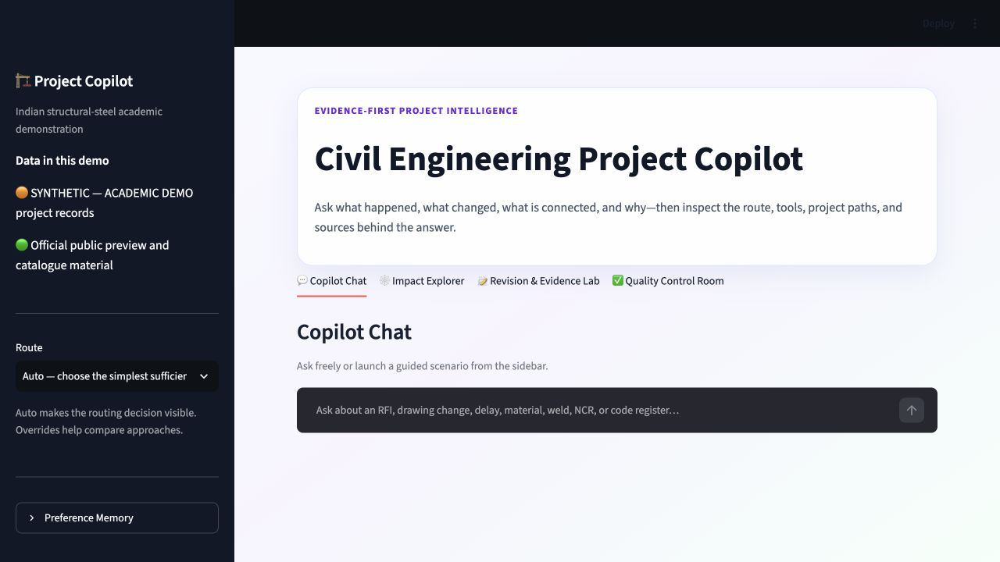
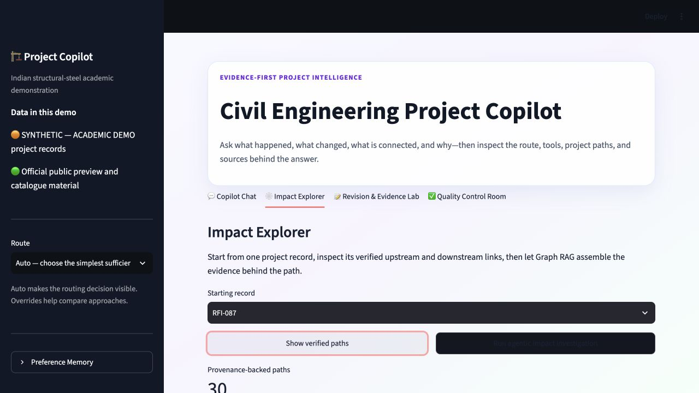
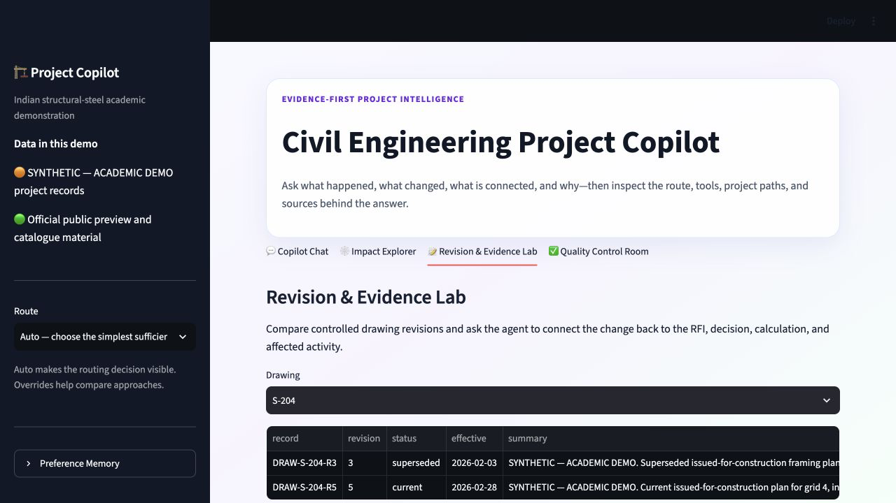
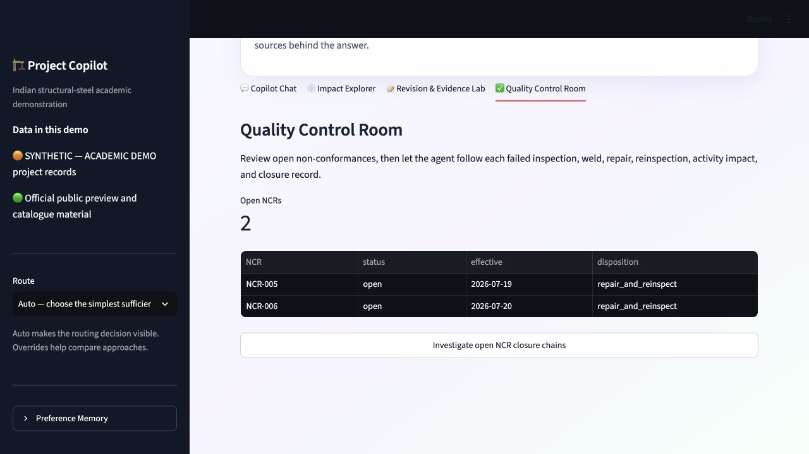
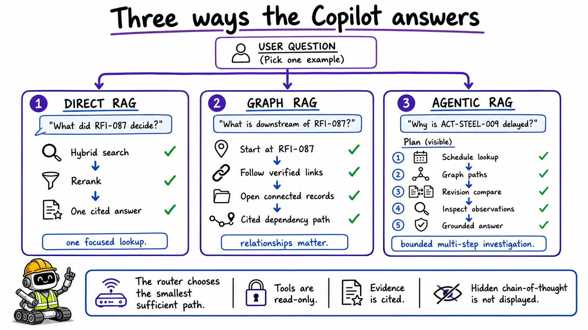
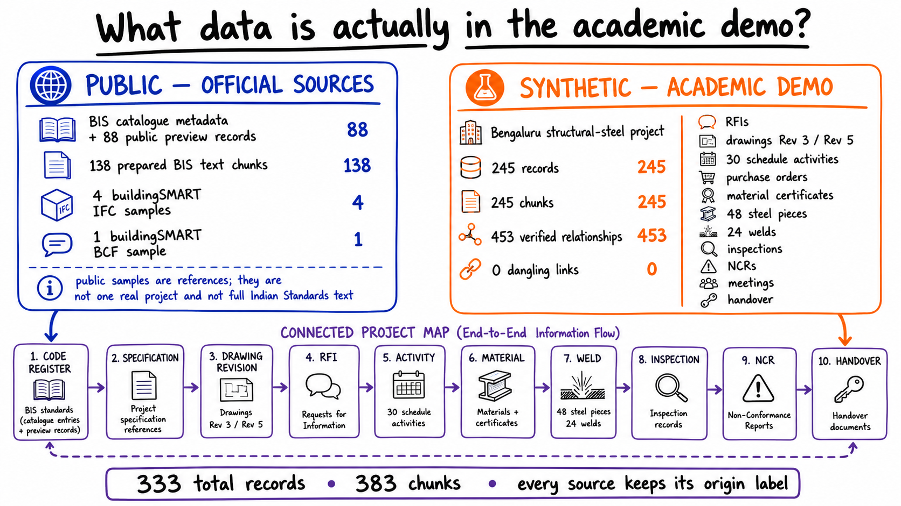

# Civil Engineering Project Copilot — Project Proposal

**Updated:** 23 August 2026

**Pilot:** India-based structural-steel building, created as an academic demonstration

**Primary standard family:** IS 800 and the related Indian building/structural standards listed in [the standards register](docs/INDIAN_STANDARDS_REGISTER.md)

## 1. Executive summary

A construction project may have thousands of drawings, questions, schedule activities, material certificates, inspection reports, and revisions. Finding one document is possible with search. Understanding how several records affect one another is much harder.

The **Civil Engineering Project Copilot** is a working, evidence-first application for that second problem. It can answer a focused question, follow verified project relationships, or run a small multi-step investigation. Every answer shows its sources. Its tools are read-only, and a human remains responsible for engineering and project decisions.

The repository deliberately combines two kinds of data:

- **Public reference data:** official BIS catalogue/public-preview material and buildingSMART sample files.
- **Synthetic project data:** a fictional but internally connected Bengaluru steel-building project, always labelled `SYNTHETIC — ACADEMIC DEMO`.

This separation is important. Public examples alone do not form one real construction project, while a connected synthetic project lets an evaluator safely test RAG, Graph RAG, Agentic RAG, tools, memory, and evaluations end to end.


## 2. Problem statement

Civil-engineering information is spread across documents and systems that use different names, formats, dates, and revisions. A project team may need to answer questions such as:

- What did an RFI decide?
- Which drawing revision is current?
- Which activity is blocked by that decision?
- Can a steel piece be traced back to its material certificate?
- Which failed weld inspections still have open non-conformance reports?

A normal document search returns matching files but does not reliably connect these facts. A general language model may produce a fluent answer without knowing the project. The proposed system must therefore retrieve project evidence first, use verified relationships when needed, and show citations in the answer.

## 3. Readers and target users

The document is written for:

- construction professionals who need verifiable project answers;
- project sponsors who need a clear value story;
- software reviewers who need the component and data boundaries;
- academic evaluators who need reproducible evidence;
- Agentic AI course evaluators who need to see RAG, Graph RAG, routing, tools, memory, and evaluations; and
- general readers who may not know civil-engineering terminology.

The product users are project managers, design/project engineers, planners, quality engineers, field engineers, document controllers, and owner representatives.

## 4. Product vision

The Copilot is a **project investigation workspace**, not only a chatbot. It provides four user experiences over the same evidence and workflow services:

| Experience | What the user does | Agentic capability shown |
|---|---|---|
| **Copilot Chat** | Asks any project question and chooses automatic or demonstration routing | Direct RAG, Graph RAG, or Agentic RAG; visible plan, tool calls, evidence, and citations |
| **Impact Explorer** | Starts from an RFI, activity, drawing, piece, weld, or NCR | Graph traversal shows downstream or upstream relationships |
| **Revision & Evidence Lab** | Compares two controlled drawing revisions and investigates affected work | Revision tool, graph paths, record lookup, and a grounded explanation |
| **Quality Control Room** | Reviews open NCRs and the welds/inspections connected to them | Routed quality investigation with bounded, read-only tools |

The actual implemented screens are shown below.









## 5. Questions the current pilot can answer

| Example question | Method | Main evidence |
|---|---|---|
| “What did RFI-087 decide?” | Direct RAG | Exact RFI record and related project text |
| “Which Indian material standard is cited for structural steel?” | Direct RAG | Project code register, specification, and official public metadata/preview records |
| “What is downstream of RFI-087?” | Graph RAG | Verified RFI → drawing/activity/dependency paths |
| “Why is ACT-STEEL-009 delayed?” | Agentic RAG | Schedule lookup, graph paths, drawing revision comparison, and retrieved evidence |
| “What changed between S-204 Rev 3 and Rev 5, and which activity is affected?” | Agentic RAG | Both drawing records, the connected RFI, and activity ACT-STEEL-009 |
| “Trace PIECE-C001 to its material certificate and handover evidence.” | Graph RAG | Piece, material certificate, weld, and handover paths |
| “Which welds remain blocked by quality problems?” | Agentic RAG | Open NCR-005/NCR-006, failed inspections, welds, and required reinspection |

If permitted evidence is missing, the application abstains instead of filling the gap from general model knowledge.

## 6. Three answer paths, in plain language



- **RAG (retrieval-augmented generation)** means “search the project information first, then answer from what was found.”
- **Graph RAG** adds the project relationship map. It is useful when the answer depends on a chain such as RFI → drawing → activity.
- **Agentic RAG** lets a controlled workflow make a short plan, call several read-only tools, inspect their results, and then answer. It is used only when one search is not enough.
- **Hybrid retrieval** combines exact-word search with meaning-based search. Exact-word search is good for identifiers such as `RFI-087`; meaning-based search helps when the question uses different wording from the record.
- **Reranking** reviews the initial search results and puts the best evidence first.

The UI displays the selected route, plan, tools, observations, and citations. It does **not** display private model chain-of-thought. This gives an evaluator a useful investigation trace without claiming that hidden reasoning text is a trustworthy explanation.

## 7. Data in the repository



### 7.1 Public reference data

- 88 official BIS public-preview/catalogue records covering 28 India building and structural standard families.
- 138 prepared BIS text chunks, each retaining its source and content-scope label.
- Four buildingSMART IFC discipline samples.
- One buildingSMART BCF sample.

These are valuable reference and format examples, but they are not one real Indian construction project. A BIS public preview is never described as the complete standard. The detailed source inventory is in the [Public Data Catalogue](docs/PUBLIC_DATA_CATALOG.md), [Data Collection Register](docs/DATA_COLLECTION_REGISTER.md), and machine-readable `data/public/MANIFEST.csv`.

### 7.2 Connected synthetic project data

The deterministic generator creates one fictional Bengaluru structural-steel project with:

- 245 records and 245 searchable chunks;
- 453 verified relationships and zero dangling links;
- project code register and specifications;
- drawing revisions 3 and 5;
- RFIs, meeting decisions, and 30 schedule activities;
- purchase orders and material test certificates;
- 48 traceable steel pieces and 24 welds;
- inspections, closed and open NCRs, repeat inspections, and handover records.

Every synthetic record is visibly labelled `SYNTHETIC — ACADEMIC DEMO`. The same seed regenerates the same records and checksums, which makes tests and demonstrations reproducible.

### 7.3 Indian standards scope

IS 800 is the central design standard for this steel-building pilot, but it cannot stand alone. The code register also considers applicable Indian standards for steel material and sections, welding/fabrication, loads, earthquakes, concrete foundations, soils, fire, services, accessibility, safety, and local approvals.

Examples include IS 2062, IS 808, IS 816, IS 9595, the IS 875 series, applicable IS 1893 parts, IS 13920 where applicable, and IS 456 for concrete work. The exact edition, amendment, project adoption, and order of precedence must be approved by a competent professional. The full scope and cautions are in the [Indian Standards Register](docs/INDIAN_STANDARDS_REGISTER.md).

## 8. High-level system architecture

The system has an **offline write path** for preparing data and an **online read path** for answering questions. The four responsibilities requested for the project are deliberately separate.

### 8.1 Data ingestion — prepare and store knowledge

1. Download permitted public files and generate the labelled academic project.
2. Preserve the source URL, checksum, date, origin, access scope, and revision.
3. Validate required fields and reject broken relationships.
4. Split long content into useful passages, called chunks.
5. Create embeddings, which are numeric representations used for meaning-based search.
6. Store structured records in PostgreSQL, searchable passages in Qdrant, and verified relationships in Neo4j.

Normal ingestion is repeatable and updates only changed content. Separate Make commands support complete, document-only, and graph-only reindexing.

### 8.2 Data retrieval — build an evidence packet

1. Apply project and access filters before searching.
2. Find exact identifiers and word matches with BM25-style sparse search.
3. Find meaning-based matches with OpenAI embeddings and Qdrant.
4. Combine both result lists, remove duplicates, and rerank them.
5. Return text, record identifiers, origin labels, and citation links—not a final answer.

### 8.3 Agents — choose the smallest sufficient route

LangGraph holds the bounded workflow state. A router selects Direct RAG, Graph RAG, or Agentic RAG. When OpenAI is configured, the language model can propose a route and tool plan; strict rules then enforce the selected route, allowed tools, and maximum step count. A deterministic router remains available for tests and fallback.

The “agents” in this project are therefore controlled coordination roles. They do not have unrestricted database access, do not write to project systems, and do not approve engineering work.

### 8.4 Tools — execute one safe operation

The allowed tools are:

- search project documents;
- open named records;
- follow project graph paths;
- compare drawing revisions;
- read a schedule activity; and
- query inspection and NCR records.

Each tool validates input, enforces access, performs one read-only operation, and returns structured evidence with citations. Agents choose tools; tools execute; retrieval ranks evidence.

## 9. Project relationship graph

The graph stores facts such as:

```text
IS 800 reference -> project specification -> drawing revision
                                         -> RFI-087 -> ACT-STEEL-009
material certificate -> steel piece -> weld -> inspection -> NCR -> reinspection
```

Typical relationships include `REFERENCES`, `REVISES`, `RESPONDS_TO`, `AFFECTS`, `BLOCKS`, `DEPENDS_ON`, `INSPECTS`, `RAISES`, and `EVIDENCED_BY`. Each relationship keeps its provenance. Graph paths are returned to the UI so the user can inspect the actual chain rather than accept an unexplained conclusion.

## 10. Memory

Project facts belong in PostgreSQL, Qdrant, and Neo4j—not in memory. **Mem0 is used only for approved user preferences**, such as a concise answer style or a preferred demonstration route.

The memory layer has an allowlist, rejects project facts and answer text, and is optional. The current integration uses the managed Mem0 service, so its API key is the only required Mem0 setting. The UI visibly reports when a saved preference was applied.

## 11. Technology choices

| Need | Choice | Reason |
|---|---|---|
| Python environment | Python 3.12 + `uv` | Fast, pinned, reproducible setup |
| RAG and model adapters | LangChain | Standard document, model, embedding, and retrieval interfaces |
| Routed workflow | LangGraph | Explicit steps, state, limits, and safe stop behavior |
| Language/embedding models | OpenAI `gpt-5-mini` + `text-embedding-3-small` | Structured routing and semantic retrieval |
| Structured project records | PostgreSQL | Reliable relational records, revision state, and audit data |
| Vector/search store | Self-hosted Qdrant | Free local Docker service for vector and filtered search |
| Relationship store | Self-hosted Neo4j | Clear graph traversal and project-path inspection |
| Preference memory | Managed Mem0 | Small, approved cross-session preferences only |
| Observability | Self-hosted Langfuse | Local traces, tool spans, latency, and evaluation visibility |
| API | FastAPI | Typed HTTP contract and automatic API documentation |
| User interface | Streamlit | Fast multi-page academic demonstration |
| Quality/security | pytest, Ruff, Bandit, pip-audit | Automated behavior, style, code, and dependency checks |
| Local operations | Docker Compose + Make | Predictable service start, stop, health, ingest, reindex, and evaluation commands |

The design is inspired by the teaching progression in the two Week 2 repositories: basic RAG, metadata, hybrid retrieval/rank fusion, routing, tool use, and Graph RAG. Production modules are shared by the API, UI, tests, evaluations, and notebooks so the teaching examples do not become a separate implementation.

## 12. Evaluation and observability

The six gold scenarios test all three routes and their expected evidence. The reproducible offline baseline currently reports:

- 100% scenario pass rate;
- 100% route accuracy;
- 100% citation coverage;
- 100% abstention accuracy;
- 84.7% recall at six results; and
- 95.8% tool-selection precision.

Retrieval is not judged by one score alone. The project also measures first-relevant-result rank, unnecessary steps, graph-path correctness, citation coverage, and whether the workflow correctly refuses an unsupported answer. `make eval-live` runs the same scenario set through configured live services.

Langfuse records a safe, masked trace of the route and tool spans. API keys and sensitive payload fields are not included. Evaluations cover retrieval, tools, and the complete workflow rather than only judging how fluent the final answer sounds.

## 13. Implementation phases and current status

| Phase | Result | Status |
|---|---|---|
| 1. Data foundation | Public source register, deterministic synthetic project, validation, provenance | Complete |
| 2. Search and graph stores | PostgreSQL, Qdrant, Neo4j, idempotent ingestion/reindexing | Complete |
| 3. Direct and Graph RAG | Hybrid retrieval, reranking, citations, verified graph paths | Complete |
| 4. Agentic workflow | LangGraph routing, bounded read-only tools, grounded answers | Complete |
| 5. Product experiences | Chat plus Impact, Revision, and Quality workspaces | Complete |
| 6. Memory and observability | Managed Mem0 preferences and local Langfuse traces | Complete |
| 7. Teaching and assurance | Five notebooks, evals, tests, security scans, demo documentation | Implemented; final checks recorded in the repository |
| 8. Real-project validation | Authorized project data and professional review | Future work |

## 14. Success criteria

The academic pilot succeeds when:

- all stored data retains a public or synthetic origin label;
- the connected project has no dangling relationships;
- exact IDs and meaning-based questions both retrieve relevant evidence;
- graph questions return inspectable relationship paths;
- agentic questions use only the required read-only tools within the step limit;
- every displayed project claim has a citation, or the system abstains;
- user preferences never replace project evidence;
- all six gold scenarios pass in repeatable evaluation; and
- another reviewer can start, ingest, evaluate, and demonstrate the system from the documented commands.

## 15. Risks and open questions

| Risk or question | Current control / next decision |
|---|---|
| Public previews are mistaken for full Indian Standards | Every record and visual states its content scope; licensed full text requires a separate authorized source |
| Synthetic data is mistaken for a real project | Orange `SYNTHETIC — ACADEMIC DEMO` label on every record and UI source |
| A relationship is plausible but not proven | Only validated links enter the trusted graph; zero-dangling-link check runs during generation |
| A fluent answer hides weak evidence | Claim citations, visible evidence, abstention, and evaluation gates |
| Model plan chooses too many or unsafe tools | Strict allowlist, canonical route plans, read-only operations, and maximum steps |
| External data boundary is misunderstood | Databases and Langfuse are local; OpenAI and managed Mem0 are external and optional/configured explicitly |
| Standard applicability or precedence is disputed | A competent professional must approve editions, amendments, local rules, and project adoption |
| Future real project has sensitive information | Project-level access filters, source permissions, secret management, and a separate authorization review |

The main future decision is which authorized real project or partner dataset can replace the synthetic layer without weakening privacy, licensing, or professional review.

## 16. Reviewer path

Start with the [README](README.md), follow the step-by-step [Demo Story](docs/DEMO_STORY.md), and use the five notebooks for focused experimentation. Operational commands and ports are documented in [Operations](docs/OPERATIONS.md); detailed source governance remains in the linked data registers.
