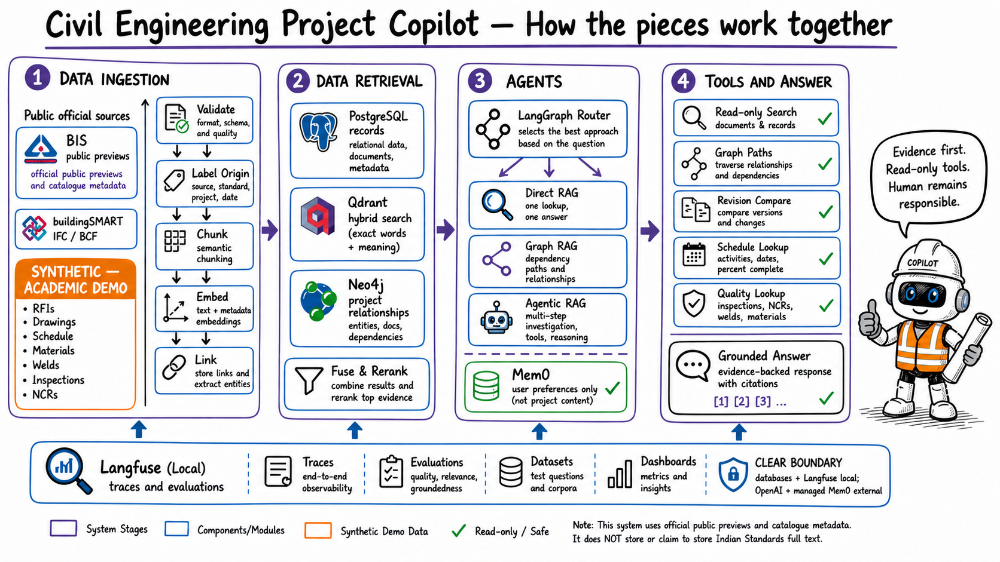
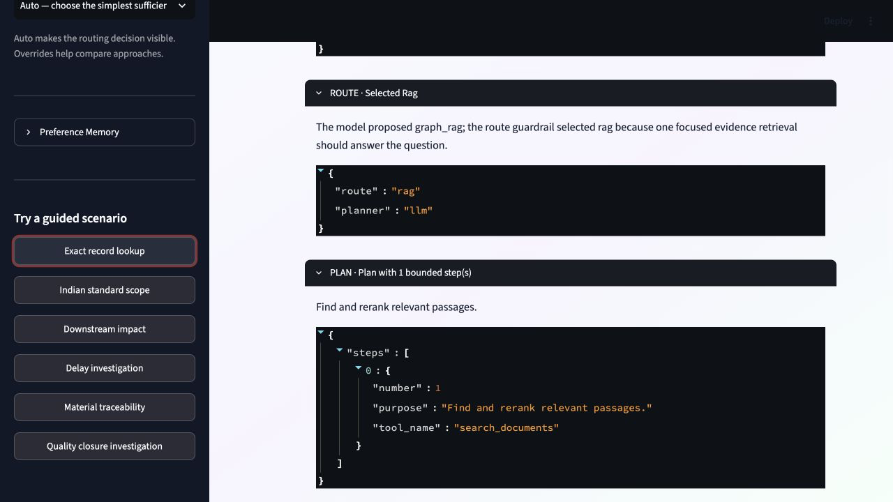

# Civil Engineering Project Copilot

An evidence-grounded RAG and Agentic AI demonstration for a connected Indian structural-steel project.



## What this project demonstrates

- **Direct RAG:** one focused project search followed by a cited answer.
- **Hybrid retrieval and reranking:** exact identifiers plus meaning-based search, then best evidence first.
- **Graph RAG:** verified dependency and traceability paths in Neo4j.
- **Agentic RAG:** a bounded LangGraph plan using read-only tools.
- **Memory:** managed Mem0 stores approved user preferences only, never project facts.
- **Evaluation:** six gold scenarios test retrieval, routes, tools, grounding, and abstention.
- **Four user experiences:** chat, impact exploration, revision comparison, and quality investigation.

The app uses official public BIS preview/catalogue data and buildingSMART samples alongside a clearly labelled `SYNTHETIC — ACADEMIC DEMO` project. Public previews are not represented as the full text of Indian Standards.



## Quick start

Prerequisites: Docker Desktop, `uv`, `make`, and Python 3.12.

```bash
cp .env.example .env
# Add OPENAI_API_KEY and MEM0_API_KEY.
# Add strong local passwords/secrets for the remaining blank values.

make setup
make services-up
make observability-up
make data-generate
make data-validate
make ingest
make health
```

Start the application in two terminals:

```bash
make api
```

```bash
make ui
```

Open:

- Application: <http://127.0.0.1:8501>
- API documentation: <http://127.0.0.1:8001/docs>
- Langfuse: <http://127.0.0.1:3000>
- Neo4j Browser: <http://127.0.0.1:7474>

Run `make help` for all commands. Ingestion is idempotent. Safe rebuilds are available as `make reindex`, `make reindex-docs`, and `make reindex-graph`; the destructive reset requires an explicit confirmation value.

## Verify the project

```bash
make test
make lint
make security
make eval
make eval-live
make notebooks
```

The reproducible offline baseline passes all six scenarios with 100% route accuracy, citation coverage, and abstention accuracy. The detailed output is stored in [`data/evals/report.json`](data/evals/report.json); live-service output is stored separately in [`data/evals/report-live.json`](data/evals/report-live.json).

## Learn and present

- [Plain-language proposal](PROPOSAL.md)
- [Step-by-step demo story](docs/DEMO_STORY.md)
- [Operations and Make commands](docs/OPERATIONS.md)
- [Executed verification report](docs/VERIFICATION.md)
- [Indian standards scope](docs/INDIAN_STANDARDS_REGISTER.md)
- [Public data catalogue](docs/PUBLIC_DATA_CATALOG.md)
- [Data foundation and provenance](docs/DATA_FOUNDATION.md)
- [Five reusable notebooks](notebooks/)

The notebooks import the same production modules used by the API and UI; they are small experiments, not a second implementation.

## Main components

| Component | Role |
|---|---|
| FastAPI + Streamlit | Typed backend and four-mode demonstration UI |
| LangChain + OpenAI | Models, embeddings, and retrieval adapters |
| LangGraph | Explicit routing and bounded workflow state |
| PostgreSQL | Authoritative structured project records |
| Qdrant | Vector and filtered document retrieval |
| Neo4j | Project dependency and traceability graph |
| Mem0 | Allowlisted user preferences only |
| Langfuse | Self-hosted traces and evaluation visibility |

This is an academic decision-support demonstration. It does not approve designs, direct construction work, certify compliance, or replace a competent professional.
